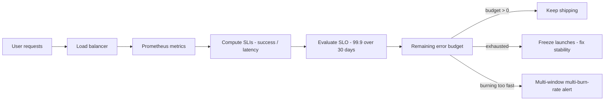

<KeyIdea>
**In one line**: measure with **indicators (SLI)**, commit to a **target (SLO)** like 99.9 %, and the rest becomes **error budget**. When the budget runs out, **freeze new feature launches and fix reliability** — Google SRE's way of resolving the dev-vs-ops tension.
</KeyIdea>

## Key concepts

<Terms items={[
  { term: "SLI", en: "Service Level Indicator", def: "**The metric itself** — e.g. 'HTTP success rate', 'p99 latency < 300ms'." },
  { term: "SLO", en: "Service Level Objective", def: "**Internal goal** — e.g. 'over a rolling 30-day window, SLI success ≥ 99.9 %'." },
  { term: "SLA", en: "Service Level Agreement", def: "**External contract** — missing it costs money / refunds. SLA < SLO leaves a cushion." },
  { term: "Error Budget", en: "Error Budget", def: "100 % minus SLO. 99.9 % / 30 days = 43.2 minutes of allowable downtime." },
  { term: "Burn Rate", en: "Burn Rate", def: "Real-time rate of budget consumption. Burning a week's budget in an hour → 'fast burn' alert." },
  { term: "Customer-perceived", en: "Customer-perceived", def: "SLI should reflect user experience (e.g. LB-edge success rate), not internal components." },
]} />

## Classic SLI types

<KV items={[
  { k: "Availability / success rate", v: "good_events / total_events — e.g. ratio of non-5xx responses." },
  { k: "Latency", v: "Fraction of requests with P50 / P95 / P99 < threshold. Use percentiles, not averages." },
  { k: "Correctness", v: "Fraction of correct outputs (e.g. order totals without errors)." },
  { k: "Freshness", v: "Data updated within ≤ X minutes (search, caching)." },
  { k: "Throughput", v: "RPS / QPS meeting business needs — usually a capacity metric, not an SLI." },
]} />

## How to use it

## Practical notes

- **Start with one SLO** per critical user journey — don't roll out 50 at once.
- **Use a 30-day rolling window** — shorter is noisy, longer is sluggish.
- **Multi-window, multi-burn-rate alerts** (Google SRE recommended): four rules — `14.4× burn 5m`, `6× burn 1h`, `3× burn 6h`, `1× burn 3d` — **few false positives, doesn't miss slow burn**.
- **SLI ≠ monitor everything**: "all health checks green" ≠ "users are happy". **Always measure from the user's perspective**.
- **Error-budget policy**: write it down: **budget < X % → freeze launches**. Otherwise nobody enforces it.
- **Dependency transparency**: your SLO can't exceed your dependency's (99.9 % depending on 99 % is mathematically impossible).
- **Composite SLO**: weighted or worst-case combination of sub-SLIs — for complex journeys (login → browse → checkout).

## Easy confusions

<Compare
  leftTitle="SLO (internal)"
  rightTitle="SLA (external)"
  left={<>
    Engineering team's **self-commitment**. 
    Slightly tighter — leaves a cushion.
  </>}
  right={<>
    Legal / financial liability. 
    Looser than SLO — **never promise customers your absolute limit**.
  </>}
/>

## Further reading

- [Prometheus metrics model](/ops/advanced/prometheus-metrics)
- [Log aggregation](/ops/advanced/log-aggregation)
- [Performance tuning](/ops/advanced/performance-tuning)
