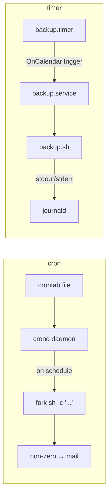

<KeyIdea>
**In one line**: there are two mainstream ways to schedule scripts: classic **cron** (short and flexible) and modern **systemd timer** (observable, journal-logged, can depend on other units). Production should prefer timer.
</KeyIdea>

## cron speedrun

```cron
# m  h  dom mon dow  command
0    3   *   *   *   /usr/local/bin/backup.sh
*/5  *   *   *   *   curl -fsSL https://example.com/healthz > /dev/null
0    9   *   *   1-5 /opt/scripts/report.sh   # Mon–Fri 09:00
@reboot                /opt/scripts/init-once.sh
```

```bash
crontab -e          # current user
crontab -l
sudo crontab -e -u root
```

## systemd timer speedrun

`/etc/systemd/system/backup.service`:

```ini
[Unit]
Description=Daily backup

[Service]
Type=oneshot
ExecStart=/usr/local/bin/backup.sh
```

`/etc/systemd/system/backup.timer`:

```ini
[Unit]
Description=Run backup daily 03:00

[Timer]
OnCalendar=*-*-* 03:00:00
Persistent=true
RandomizedDelaySec=10min

[Install]
WantedBy=timers.target
```

```bash
sudo systemctl enable --now backup.timer
systemctl list-timers
journalctl -u backup.service
```

## Analogy

<Analogy>
cron is **a sticky note on the fridge** — reminds you once at the time, but **whether you did it or not, nobody knows**.
systemd timer is **a calendar event with read receipt** — fires a service, full logs + retries on failure + dependency tracking.
</Analogy>

## Key concepts

<Terms items={[
  { term: "Five cron fields", en: "min hour dom mon dow", def: "wildcard * / range 1-5 / step */15 / list 1,15." },
  { term: "Environment", en: "cron's classic gotcha", def: "cron does **not** source your `~/.bashrc`; PATH is minimal. Use absolute paths or `source` something." },
  { term: "OnCalendar", en: "Timer time expression", def: "More natural than cron: `Mon..Fri 09:00`, `hourly`, `daily`." },
  { term: "Persistent=true", en: "Catch up", def: "Run missed jobs after the machine boots. cron can't do this." },
  { term: "RandomizedDelaySec", en: "Jitter", def: "Avoids every node hammering origin at the same second." },
]} />

## How it works



## Practical notes

- **cron output is mailed** — without mail configured it piles up in `/var/spool/mail/`. **Redirect to a log file**: `>> /var/log/backup.log 2>&1`.
- **Timers log to journal by default**: `journalctl -u backup`.
- **Avoid the top of the hour**: `0 0 * * *` makes the whole fleet hit origin at once. Use `7 0 * * *` or timer `RandomizedDelaySec`.
- **cron expression debugging**: [crontab.guru](https://crontab.guru) shows next runs.
- **Jobs must be idempotent** — scheduled tasks must **survive multiple runs** (retries / catch-up).
- **`@reboot`** runs once when cron restarts, not every boot. Use systemd timer + `OnBootSec=1min` for boot-time scheduling.

## Easy confusions

<Compare
  leftTitle="cron"
  rightTitle="systemd timer"
  left={<>
    Decades old, one-line config.<br />
    You handle logging and catch-up yourself.
  </>}
  right={<>
    Journal integration, dependency / resource limits.<br />
    More verbose, **better in production**.
  </>}
/>

## Further reading

- [systemd](/ops/beginner/systemd)
- [Log system](/ops/beginner/log-system)
- [Shell scripting](/ops/beginner/shell-basics)
