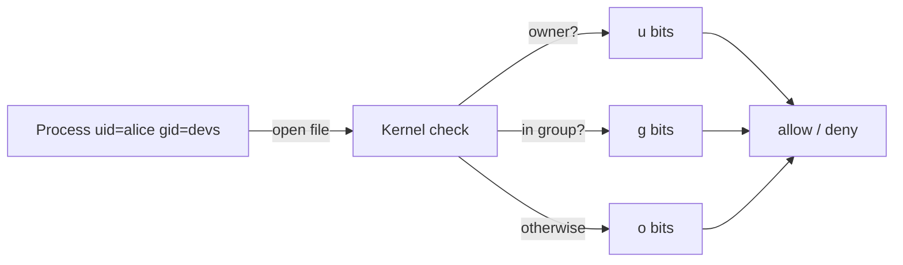

<KeyIdea>
**In one line**: every file / directory has an **owner** and a **group**, with r / w / x bits assigned separately to **owner / group / others** — 9 bits decide everything.
</KeyIdea>

## What it is

```
ls -l output:
-rwxr-xr-- 1 alice devs 42 Aug 1 12:34 run.sh
│└┬┘└┬┘└┬┘   └┬─┘ └┬─┘
│ │  │  │     │    └ group
│ │  │  │     └ owner
│ │  │  └ other r — no write, no execute
│ │  └ group r-x — read + execute
│ └ user rwx — full
└ type: - / d / l / b / c
```

Octal: r=4, w=2, x=1 → `rwxr-xr--` = 754.

## Analogy

<Analogy>
Like an **office building's badge system**:
- **u (user)** = you;
- **g (group)** = your department;
- **o (other)** = anyone else in the building.

Each door has three permissions: enter / modify the door / change its lock.
</Analogy>

## Key concepts

<Terms items={[
  { term: "r / w / x", en: "read / write / execute", def: "On a directory, r = list, x = enter, w = create / delete entries inside." },
  { term: "chmod", en: "change mode", def: "`chmod 755 file` (octal) or `chmod g+w file` (symbolic)." },
  { term: "chown", en: "change owner", def: "`chown alice:devs file`." },
  { term: "umask", en: "default mask", def: "Default perms for newly-created files = full perms minus umask. Common: 022." },
  { term: "SUID / SGID / Sticky", en: "Special bits", def: "SUID(4) executes as owner; SGID(2) makes new files in a dir inherit the group; Sticky(1) on /tmp restricts deletion to file owners." },
  { term: "ACL", en: "Extended ACLs", def: "When rwx isn't expressive enough — `setfacl / getfacl` grants per-user extras." },
]} />

## Cheatsheet

```bash
chmod 755 script.sh        # rwxr-xr-x
chmod 644 README.md        # rw-r--r--
chmod -R u+w,g-w dir/      # recursive
chown -R deploy:web /var/www/site

# I write / others read
umask 022

# /tmp sticky bit (already on by default)
chmod 1777 /tmp

# Grant one specific user read access (without touching group)
setfacl -m u:bob:r-- secret.txt
```

## How it works



The kernel cares about **process uid / gid + file metadata only** — not login names or paths.

## Practical notes

- **Avoid 777 in production** — basically "everyone can edit".
- **Missing dir x = can't `cd`** — common trip-up after `chmod -x dir`.
- **Missing file x = can't direct-exec** — but `bash file` still works (the interpreter reads it for you).
- **Run services as least-privileged users** (`www-data` / `nginx`) — never as root.
- **`ls -la`** shows hidden dotfiles.
- **`stat file`** shows full metadata (uid / mtime / inode / block size).

## Easy confusions

<Compare
  leftTitle="rwx bits"
  rightTitle="ACLs"
  left={<>
    Simple 9 bits + 3 categories.<br />
    Covers 95 % of cases.
  </>}
  right={<>
    Per-user / per-group fine-grained.<br />
    Use only when needed; don't overuse.
  </>}
/>

## Further reading

- [Linux speedrun](/ops/beginner/linux-quickstart)
- [Users & groups](/ops/beginner/user-group)
- [SSH](/ops/beginner/ssh)
