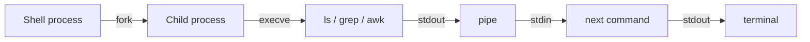

<KeyIdea>
**In one line**: the Linux philosophy is "**everything is a file + small composable tools**". Master a few dozen commands plus redirection and pipes and **you can do 90 % of day-to-day ops**.
</KeyIdea>

## Directory layout (FHS)

```
/etc       Global config (nginx.conf, systemd units)
/var       Variable data (logs in /var/log, DBs in /var/lib)
/usr       Distro programs and libraries
/opt       Third-party self-contained apps
/home      User home directories
/root      Root user's home
/tmp       Temp files, wiped on reboot
/proc /sys Kernel virtual filesystems (process info / kernel knobs)
```

Every file / device / network socket appears as a path — that's "everything is a file".

## Analogy

<Analogy>
Linux is **a box of Lego bricks** — each command (`grep` / `sort` / `awk`) is one brick; **pipe them together with `|`** to build any shape. Windows leans toward "one giant app solves everything".
</Analogy>

## Must-know commands by category

<KV items={[
  { k: "View / browse", v: "ls / cat / less / tail / head / file" },
  { k: "Navigate", v: "cd / pwd / pushd / popd" },
  { k: "File ops", v: "cp / mv / rm / mkdir / ln" },
  { k: "Search", v: "find / grep / rg (ripgrep) / locate" },
  { k: "Processes", v: "ps / top / htop / kill / pgrep" },
  { k: "Permissions", v: "chmod / chown / chgrp" },
  { k: "Network", v: "ip / ss / curl / dig" },
  { k: "Archives", v: "tar / gzip / zstd / unzip" },
  { k: "Text", v: "sed / awk / cut / sort / uniq / wc" },
]} />

## Redirection and pipes

```bash
cmd > file       # stdout to file (overwrite)
cmd >> file      # append
cmd 2> err.log   # redirect stderr
cmd > out 2>&1   # both into out
cmd1 | cmd2      # cmd1's stdout becomes cmd2's stdin
< file cmd       # stdin from file
```

`|` is Linux's most powerful idea:

```bash
ps aux | grep nginx | awk '{print $2}' | xargs kill -9
```

## How it works



Each command is a fork + exec'd process; stdin / stdout / stderr are its "three pipes".

## Practical notes

- **`man cmd` / `tldr cmd`** — man is canonical; [tldr](https://tldr.sh) is a quick cheatsheet of common usage.
- **Use `xargs`** to convert stdin to arguments: `find . -name '*.log' | xargs rm -f`.
- **`rm -rf` cautiously** — especially with variables. Echo first: `echo rm -rf "$DIR"/*`.
- **Env vars**: `export VAR=val` for the current shell; persist in `~/.bashrc` / `~/.zshrc`.
- **Background**: `cmd &` runs in background; `nohup cmd > log 2>&1 &` survives logout. In production use systemd.
- **History search**: Ctrl+R reverse-searches your history — far faster than ↑.

## Easy confusions

<Compare
  leftTitle="bash"
  rightTitle="zsh"
  left={<>
    Default on nearly every distro.<br />
    Best script compatibility.
  </>}
  right={<>
    macOS default; oh-my-zsh is delightful.<br />
    Slight script-syntax drift from bash.
  </>}
/>

## Further reading

- [File permissions](/ops/beginner/file-permission)
- [Processes & signals](/ops/beginner/process-signal)
- [Shell basics](/ops/beginner/shell-basics)
