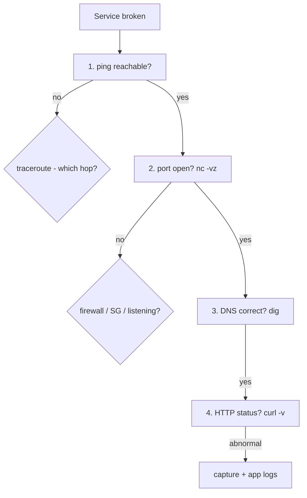

<KeyIdea>
**In one line**: a handful of commands cover almost every server-side network bug. **`ip` for interfaces, `ss` for connections, `curl/dig` for application checks, `nc` for port checks, `tcpdump` for capture**. Memorize these and you'll diagnose 95 % of issues.
</KeyIdea>

## Cheatsheet

```bash
# Interfaces & routes
ip a                         # IP addresses
ip r                         # routing table
ip neigh                     # ARP / NDP

# Connections / ports
ss -tlnp                     # listening TCP + process
ss -tnp                      # established TCP
ss -tnp '( dport = :443 )'   # filter
netstat -tlnp                # old-school (prefer ss)

# DNS
dig www.example.com
dig +short www.example.com
dig @8.8.8.8 example.com mx
host example.com
nslookup example.com

# HTTP / port connectivity
curl -I https://example.com
curl -v https://example.com
curl --resolve example.com:443:1.2.3.4 https://example.com   # force IP
nc -vz host 443                   # TCP connectivity
nc -u -vz host 53                 # UDP probe (unreliable)
telnet host 443                   # legacy TCP test

# Capture
tcpdump -i any -nn -s0 'host 1.2.3.4 and port 443'
tcpdump -i eth0 -w out.pcap 'tcp port 80'

# Firewall
iptables -L -n -v
nft list ruleset
ufw status

# Path
ping -c 5 1.1.1.1
mtr -wbz example.com
traceroute -T -p 443 example.com
```

## Analogy

<Analogy>
These commands are **a surgeon's instrument tray** — each looks ordinary, but you need to **know which one to grab when**.
</Analogy>

## Key concepts

<Terms items={[
  { term: "ip", en: "iproute2", def: "Modern standard — replaces ifconfig / route." },
  { term: "ss", en: "Socket Stat", def: "Replacement for netstat — faster, more info." },
  { term: "curl", en: "URL client", def: "Can imitate almost any HTTP / FTP request. `-v` shows full round-trip." },
  { term: "dig", en: "DNS tool", def: "More precise than nslookup, structured output." },
  { term: "nc", en: "Netcat", def: "Swiss-army knife — sends arbitrary TCP/UDP, can listen on ports." },
  { term: "tcpdump", en: "CLI capture", def: "BPF filter, writes pcap files for Wireshark." },
]} />

## Triage flow



Layered isolation = the heart of triage.

## Practical notes

- **`curl -v` is the gold standard** — shows DNS, TCP handshake, TLS handshake, HTTP headers, body — a full simulated browser request in one line.
- **`ss -s`**: one-line summary of all sockets (listening / established / TIME_WAIT).
- **tcpdump tips**: `-nn` skip name resolution (faster), `-s0` capture full packets, write pcap and open in Wireshark.
- **Common misdiagnoses**: ping fails ≠ service down (ICMP filtered); port open ≠ service healthy (app crashed but listener remains).
- **DNS not cached?** Use `systemd-resolved` or `dnsmasq` locally; flush via `resolvectl flush-caches`.
- **Service can't reach itself?** Binding `127.0.0.1` vs being accessed via internal IP — bind to `0.0.0.0` to allow remote connections.

## Easy confusions

<Compare
  leftTitle="netstat / ifconfig"
  rightTitle="ss / ip"
  left={<>
    Legacy net-tools, sometimes not installed by default.
  </>}
  right={<>
    iproute2 modern standard — **prefer this**.
  </>}
/>

## Further reading

- [Ping](/network/beginner/ping) / [Traceroute](/network/beginner/traceroute)
- [Wireshark](/network/ecosystem/wireshark)
- [SSH](/ops/beginner/ssh)
