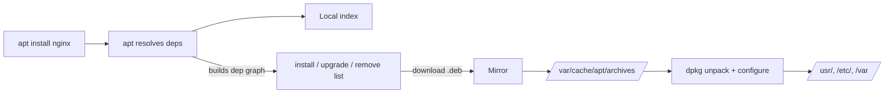

<KeyIdea>
**In one line**: a package manager is the distro's **app store** — resolves dependencies, verifies signatures, upgrades uniformly, removes cleanly. **Always reach for the package manager first**; build from source as a last resort.
</KeyIdea>

## Mainstream package managers

<KV items={[
  { k: "Debian / Ubuntu", v: "apt (high-level) / dpkg (low-level); .deb" },
  { k: "RHEL / CentOS / Fedora / Rocky", v: "dnf (new) / yum (old); .rpm" },
  { k: "Alpine", v: "apk; lightweight — common in containers" },
  { k: "Arch", v: "pacman; rolling release" },
  { k: "macOS", v: "brew (user-level)" },
  { k: "Cross-distro", v: "snap / flatpak / appimage (sandboxed)" },
  { k: "Language-level", v: "pip / npm / cargo / gem / composer (not system packages)" },
]} />

## Analogy

<Analogy>
**Package manager** = **a vetted app store**: auto-installs deps, checks signatures, uninstall is a single command.
**Build from source** = **assembling Lego yourself**: you control everything, but **upgrade / uninstall / dependencies** are now your bookkeeping.
</Analogy>

## Common commands side-by-side

```bash
# Ubuntu / Debian
sudo apt update                  # refresh sources
sudo apt install -y nginx        # install
sudo apt upgrade                 # upgrade everything
sudo apt remove nginx            # uninstall (keeps config)
sudo apt purge nginx             # uninstall + remove config
apt list --installed | grep nginx
apt-cache search keyword
dpkg -L nginx                    # list files

# RHEL / Fedora
sudo dnf install -y nginx
sudo dnf update
sudo dnf remove nginx
rpm -qa | grep nginx
rpm -ql nginx

# Arch
sudo pacman -S nginx
sudo pacman -Syu                 # sync + upgrade all
yay -S aur-package               # AUR

# Alpine
apk add nginx
apk update && apk upgrade
```

## Key concepts

<Terms items={[
  { term: "Source / Repo", en: "Repository", def: "`/etc/apt/sources.list`, `/etc/yum.repos.d/`. Switching to a closer mirror is a huge speedup." },
  { term: "Dependencies / Reverse deps", en: "Depends / Reverse Depends", def: "Web of inter-package dependencies. Removing one often cascades." },
  { term: "Signatures", en: "GPG / RPM signatures", def: "Public-key verification ensures packages haven't been tampered with. Import the key when adding third-party repos." },
  { term: "Pin / Hold", en: "Pin", def: "`apt-mark hold pkg` locks a package at its current version." },
  { term: "PPA / COPR", en: "Third-party repos", def: "Ubuntu's PPA, Fedora's COPR — community-built packages." },
  { term: "snap / flatpak", en: "Sandboxed packages", def: "Bundle their own dependencies, cross-distro — bigger disk, slower startup." },
]} />

## How it works



## Practical notes

- **Always update before install**: `apt update && apt install`.
- **Auto-updates**: install `unattended-upgrades` on Debian/Ubuntu for automatic security patches.
- **Add a third-party repo**: import GPG key → write `/etc/apt/sources.list.d/xxx.list` → `apt update`.
- **Server minimization**: pick the server / minimal image — **don't pull in desktop packages**.
- **Inside containers**: alpine uses apk, ubuntu/debian uses apt — **clear caches after install**: `rm -rf /var/lib/apt/lists/*` shrinks the image.
- **Don't use `pip install --user` for system services** — multi-user / CI gets messy. Use venv / pipx / uv.
- **Find which package provides a file**:

  ```bash
  apt-file search /usr/bin/nginx        # Debian
  dnf provides /usr/bin/nginx           # RHEL
  ```

## Easy confusions

<Compare
  leftTitle="System package mgr"
  rightTitle="Language package mgr"
  left={<>
    apt / dnf / brew.<br />
    System-level binaries + libs.
  </>}
  right={<>
    pip / npm / cargo.<br />
    Application deps — **scope to projects, not system**.
  </>}
/>

## Further reading

- [Linux speedrun](/ops/beginner/linux-quickstart)
- [systemd](/ops/beginner/systemd)
- [Docker](/ops/advanced/docker)
