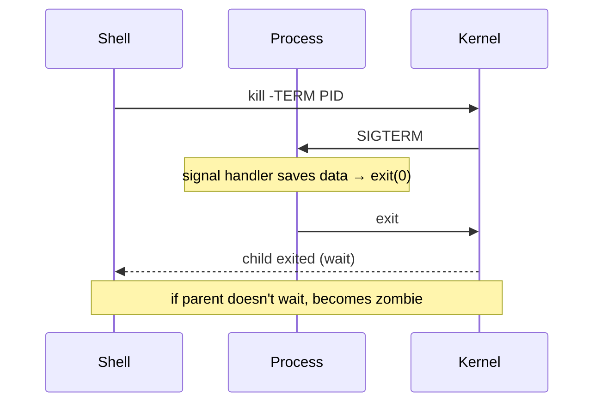

<KeyIdea>
**In one line**: every running program on Linux is a **process**; processes communicate via **signals**; `kill` isn't a verb — it means "**send signal**". SIGTERM (15) asks for graceful shutdown; SIGKILL (9) lets the kernel reap the corpse.
</KeyIdea>

## What it is

```
process = a running instance of a program
          ↓
          PID  (process id)
          PPID (parent pid)
          UID / GID (identity)
          state (R / S / D / Z / T)
```

Every process has a parent; init / systemd (PID 1) is the ancestor of all.

## Analogy

<Analogy>
A process is **an actor on stage**.
`SIGTERM` = **closing-time bell**: "wrap up and head home" — the actor saves their things and exits.
`SIGKILL` = **pulling the breaker**: the stage goes black instantly — anything unsaved is lost.
A zombie process is like **an actor who left but whose paycheck isn't closed out** — the parent process never signed off.
</Analogy>

## Key concepts

<Terms items={[
  { term: "PID", en: "Process ID", def: "Unique number. pid 1 = init / systemd." },
  { term: "State", en: "ps STAT column", def: "R running / S sleeping / D uninterruptible (in I/O) / Z zombie / T stopped." },
  { term: "Signal", en: "Signal", def: "Async notification from OS. Common: 1 HUP, 2 INT, 9 KILL, 15 TERM." },
  { term: "Orphan", en: "Orphan", def: "Parent died, init / systemd adopts. Harmless." },
  { term: "Zombie", en: "Zombie / defunct", def: "Child exited but parent never `wait()`s. Tiny resource cost — but **lots of zombies = parent has a bug**." },
  { term: "Daemon", en: "Daemon", def: "Long-running background process detached from a terminal — names traditionally end in `d` (sshd / nginxd)." },
]} />

## How it works



`SIGKILL` (9) and `SIGSTOP` are the **only two signals a process can't catch or ignore**.

## Practical notes

- **`ps aux | grep xxx`** or `pgrep -fa xxx` to find processes.
- **`top` / `htop` / `btop`**: real-time CPU / memory.
- **Always SIGTERM first** when stopping a service — default `kill PID` is 15. Wait a few seconds, then `kill -9` if needed.
- **Cost of straight -9**: open connections aren't closed, buffered data is lost, temp files leak — databases especially hate this.
- **Kill a process group**: `kill -- -PGID` or `pkill -P PID` so children aren't missed.
- **`SIGHUP` (1) typically means "reload config"** — nginx / sshd / etc. follow this convention.
- **Zombies can't be killed** — find the PPID and exit the parent (init then reaps).
- **`strace -p PID`** shows which syscall a process is in — invaluable for "stuck" diagnosis.

## Easy confusions

<Compare
  leftTitle="kill (TERM)"
  rightTitle="kill -9 (KILL)"
  left={<>
    Gives the process **a chance to clean up**.<br />
    Can be ignored (rarely).
  </>}
  right={<>
    Kernel **forcibly reaps**.<br />
    Unstoppable — may lose data.
  </>}
/>

## Further reading

- [Linux speedrun](/ops/beginner/linux-quickstart)
- [systemd](/ops/beginner/systemd)
- [Log system](/ops/beginner/log-system)
