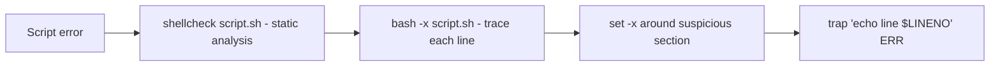

<KeyIdea>
**In one line**: bash scripts are quick to write but full of footguns. The trio **`set -euo pipefail`** + always-quote variables + shellcheck eliminates 90 % of hidden bugs.
</KeyIdea>

## What it is

Minimal viable script:

```bash
#!/usr/bin/env bash
set -euo pipefail

NAME="${1:-world}"
echo "Hello, $NAME"

for f in *.log; do
  echo "processing $f"
  gzip "$f"
done
```

`#!/usr/bin/env bash` is more portable than `#!/bin/bash` (uses PATH).

## Analogy

<Analogy>
bash is **glue language** — it sticks small tools together. **Don't use it for complex logic** — once a script crosses 100 lines, switch to Python / Go.
</Analogy>

## Key concepts

<Terms items={[
  { term: "shebang", en: "#!", def: "First line tells the kernel which interpreter to use." },
  { term: "set -e", en: "errexit", def: "Exit immediately on any non-zero return." },
  { term: "set -u", en: "nounset", def: "Error on unset variables (prevents `rm -rf $UNDEFINED/`)." },
  { term: "set -o pipefail", en: "pipefail", def: "Any failure in a pipeline fails the whole pipeline (default only checks the last command)." },
  { term: "trap", en: "Signal / exit hook", def: "`trap cleanup EXIT` — clean up temp files before the script exits." },
  { term: "$1 / $@ / $#", en: "Positional args", def: "$1 first arg; $@ all; $# count." },
  { term: "$(cmd)", en: "Command substitution", def: "Embeds cmd output into a string (clearer than backticks)." },
]} />

## Common template

```bash
#!/usr/bin/env bash
set -euo pipefail
IFS=$'\n\t'

log() { echo "[$(date +%T)] $*" >&2; }

cleanup() {
  rm -f "$tmp"
}
trap cleanup EXIT

tmp=$(mktemp)
log "starting"

# Bail loudly when required env vars are missing:
: "${API_KEY:?need API_KEY}"

# Safe quoting — paths with spaces are fine
for f in "$dir"/*.log; do
  [[ -e "$f" ]] || continue
  gzip "$f"
done

log "done"
```

## Debugging recipe



`shellcheck` is mandatory — catches unquoted vars, wrong `==`, `[ ]` vs `[[ ]]` issues, etc.

## Practical notes

- **Always quote variables**: `"$var"` — strings with spaces / globs won't split into multiple args.
- **Prefer `[[ ]]` over `[ ]`**: modern bash test, **safe even without quotes**.
- **Use `${var:-default}` / `${var:?msg}`** for fallback / required-arg checks.
- **Don't parse `ls`** — use `for f in *` or `find ... -print0 | xargs -0`.
- **Don't ignore errors**: `cmd || die "msg"`, `if ! cmd; then ... fi`.
- **Temp files via mktemp** — avoids race conditions and shared `/tmp` collisions.
- **Past 100 lines → Python.** Picking bash for complex logic is usually the wrong language choice.

## Easy confusions

<Compare
  leftTitle="bash script"
  rightTitle="ad-hoc command"
  left={<>
    File + shebang + `set -euo pipefail`.<br />
    Reusable, CI-friendly.
  </>}
  right={<>
    One-shot pipeline `cmd1 | cmd2 | cmd3`.<br />
    Fine for debugging — **don't paste it into prod**.
  </>}
/>

## Further reading

- [Linux speedrun](/ops/beginner/linux-quickstart)
- [Processes & signals](/ops/beginner/process-signal)
- [Log system](/ops/beginner/log-system)
