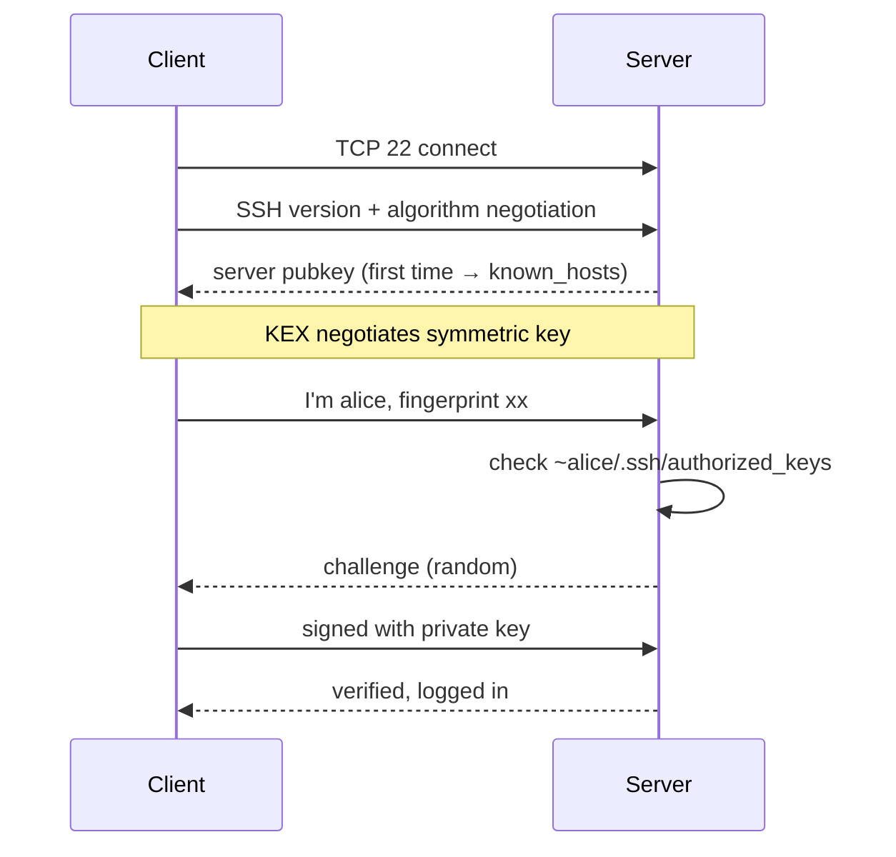

<KeyIdea>
**In one line**: SSH is the Swiss-army knife of remote access — login + remote exec + port forwarding. Use **keys, not passwords** + centralize via `~/.ssh/config` + master tunnels, and ops-day-to-day gets twice as fast.
</KeyIdea>

## What it is

Three most common usages:

```bash
# Login
ssh user@host

# Run a remote command
ssh host 'docker ps'

# Copy files
scp file user@host:/path/
rsync -aP local/ user@host:remote/

# Port forwarding
ssh -L 5432:db.internal:5432 user@bastion   # local → remote
ssh -R 8080:localhost:3000 user@public      # remote-back-to-local
```

## Analogy

<Analogy>
SSH is **an encrypted phone switchboard**. Beyond connecting you (login), it can **patch through to other extensions** (port forwarding) or **dial into the other party's internal phones** (jump host) — all encrypted and mutually authenticated.
</Analogy>

## Key concepts

<Terms items={[
  { term: "Pubkey auth", en: "Pubkey Auth", def: "Client holds private key (id_ed25519); server has public key in authorized_keys; handshake verifies a signature." },
  { term: "ssh-agent", en: "Key agent", def: "Local long-running process holding private keys, so you don't type the passphrase every time." },
  { term: "ProxyJump", en: "Jump host", def: "`ssh -J bastion target` — supports multi-hop." },
  { term: "ssh config", en: "~/.ssh/config", def: "Encode Host / HostName / User / IdentityFile per alias; type only the alias." },
  { term: "known_hosts", en: "Host fingerprint", def: "First connection records server's pubkey fingerprint; alerts on changes (MITM defense)." },
  { term: "Tunnel", en: "Tunnel", def: "-L local forward / -R reverse forward / -D SOCKS proxy." },
]} />

## Recommended config

`~/.ssh/config`:

```
Host bastion
    HostName 1.2.3.4
    User ops
    IdentityFile ~/.ssh/id_ed25519

Host db
    HostName 10.0.0.20
    User ops
    ProxyJump bastion
    ForwardAgent no

Host *
    ServerAliveInterval 30
    ServerAliveCountMax 3
    HashKnownHosts yes
```

After this, `ssh db` automatically jumps via the bastion.

`/etc/ssh/sshd_config` (server hardening):

```
PermitRootLogin no
PasswordAuthentication no
PubkeyAuthentication yes
AllowUsers deploy ops
MaxAuthTries 3
```

## How it works



After this, all operations (shell / scp / forwards) are **multiplexed** on the encrypted channel.

## Practical notes

- **Generate keys**: `ssh-keygen -t ed25519` — smaller and stronger than RSA.
- **Copy pubkey**: `ssh-copy-id user@host`.
- **Disable password login**: `PasswordAuthentication no`.
- **ControlMaster**: `ControlMaster auto` + `ControlPath` reuses one TCP for multiple ssh sessions — **much faster**.
- **SOCKS proxy**: `ssh -D 1080 host`, point your browser at SOCKS5 → "one ssh = lightweight VPN".
- **Audit**: `/var/log/auth.log` or `journalctl -u sshd`. Brute-force attempts? Install fail2ban.
- **fish/zsh users**: sshd uses `$SHELL` and won't auto-read `.profile` — put env vars in `.bashrc`/`.zshrc`.

## Easy confusions

<Compare
  leftTitle="Password login"
  rightTitle="Key login"
  left={<>
    Brute-forceable.<br />
    OK for new device / one-off.
  </>}
  right={<>
    Cryptographic strength.<br />
    Production default.
  </>}
/>

## Further reading

- [Users & groups](/ops/beginner/user-group)
- [WireGuard / Tailscale](/network/ecosystem/wireguard-tailscale) — private overlay above SSH
- [TLS handshake](/network/advanced/tls-handshake) — similar handshake idea
