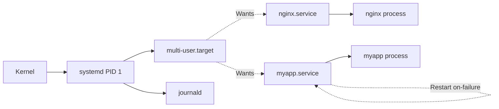

<KeyIdea>
**In one line**: systemd is Linux's **PID 1 init**, unifying service management, dependencies, logging, timers, and cgroup resource limits. **The standard way to deploy a production service** is to write a service unit.
</KeyIdea>

## What it is

Minimal service unit at `/etc/systemd/system/myapp.service`:

```ini
[Unit]
Description=My App
After=network.target

[Service]
Type=simple
User=myapp
WorkingDirectory=/opt/myapp
ExecStart=/opt/myapp/bin/serve
Restart=on-failure
RestartSec=5
Environment="PORT=8080"
LimitNOFILE=65536

[Install]
WantedBy=multi-user.target
```

```bash
sudo systemctl daemon-reload
sudo systemctl enable --now myapp
journalctl -u myapp -f
```

## Analogy

<Analogy>
systemd is **the building's facilities team**: decides which tenants open when (startup order), how to recover from a power cut (auto-restart), how much electricity each can draw (cgroups), and what security records to keep (journal).
</Analogy>

## Key concepts

<Terms items={[
  { term: "Unit", en: "Unit", def: "service / socket / timer / mount / target. Everything is a unit." },
  { term: "Target", en: "Target", def: "A grouping of units, similar to runlevels. `multi-user.target` is the normal state." },
  { term: "Dependencies", en: "Wants/Requires/After", def: "`Wants` weak, `Requires` hard, `After` ordering only." },
  { term: "Restart", en: "Restart policy", def: "no / always / on-failure / on-abnormal. Production = `on-failure` + `RestartSec`." },
  { term: "Type", en: "Service Type", def: "simple (foreground) / forking / notify (self-reports ready) / oneshot." },
  { term: "Drop-in", en: "Drop-in override", def: "`/etc/systemd/system/<unit>.d/override.conf` overrides specific fields without editing the unit." },
  { term: "Timer", en: "Timer", def: "Cron replacement — more flexible and observable." },
]} />

## Common commands

```bash
systemctl status nginx
systemctl start / stop / restart / reload nginx
systemctl enable --now nginx        # boot-enable + start now
systemctl disable --now nginx
systemctl daemon-reload             # required after editing unit files
systemctl list-units --type=service
systemctl edit nginx                # create drop-in override
journalctl -u nginx -f
systemd-analyze blame               # which units slow boot
```

## How it works



systemd uses **cgroups** to track every child a service forks — no process can escape.

## Practical notes

- **Production must-haves**: `Restart=on-failure` + `RestartSec=` + `LimitNOFILE=` + a dedicated `User=`.
- **Security sandbox fields are free wins**: `ProtectSystem=strict`, `ProtectHome=true`, `PrivateTmp=true`, `NoNewPrivileges=true`, `CapabilityBoundingSet=` — reduces blast radius after a compromise.
- **Resource limits**: `MemoryMax=2G`, `CPUQuota=50%` — more modern than ulimit.
- **Timers replace cron**:

  ```ini
  # /etc/systemd/system/backup.timer
  [Timer]
  OnCalendar=*-*-* 03:00:00
  Persistent=true
  [Install]
  WantedBy=timers.target
  ```

- **`systemd-cgtop`**: top-style view of per-service resource usage.
- **Socket activation**: listen on a port → service spins up only on first connection, saves memory.

## Easy confusions

<Compare
  leftTitle="systemd"
  rightTitle="SysV init / nohup"
  left={<>
    Auto-restart + logs + cgroups + deps.<br />
    Production standard.
  </>}
  right={<>
    A shell script that starts something.<br />
    No restart on crash, scattered logs, unobservable.
  </>}
/>

## Further reading

- [Log system](/ops/beginner/log-system)
- [cron](/ops/beginner/cron)
- [Docker](/ops/advanced/docker) — containers don't usually run systemd inside
