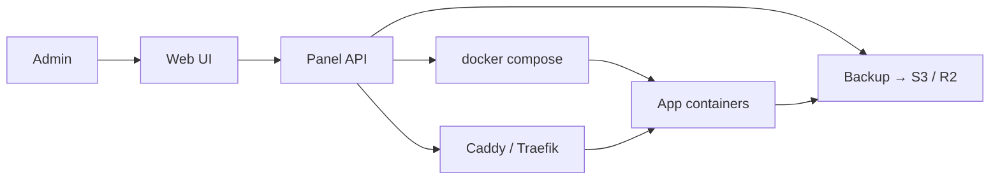

<KeyIdea>
**In one line**: these tools wrap **Docker / Compose / Caddy / DBs / backups** into a web UI — on a single VPS you click a few times to deploy apps, get HTTPS, and monitor resources. **Personal / small teams skip K8s** and still look professional.
</KeyIdea>

## Mainstream self-hosted panels

<KV items={[
  { k: "1Panel", v: "Active in China; Linux server management + Docker app store + WAF + backups. Chinese-language friendly." },
  { k: "Coolify", v: "Open-source Heroku/Vercel alternative. Git-push to deploy, auto HTTPS, managed databases." },
  { k: "Dokploy", v: "Like Coolify — clean UI, rich templates." },
  { k: "Portainer", v: "Long-standing Docker / K8s management panel — ops-leaning." },
  { k: "CasaOS / Yunohost / Cosmos Cloud", v: "Home-server / NAS style — app-store first." },
]} />

## Analogy

<Analogy>
ssh + docker compose by hand = **bare metal**;
Vercel / Render = **hosted SaaS**;
1Panel / Coolify = **your own Vercel** — same UX, but **sovereignty stays yours** (data / domains / cost).
</Analogy>

## Common features

<Terms items={[
  { term: "App templates", en: "App Templates", def: "One-click deploy of WordPress / GitLab / Plausible / Umami, etc." },
  { term: "Git deploys", en: "Git Deploy", def: "Coolify-style auto-detects Dockerfile / Nixpacks / Buildpack." },
  { term: "Automatic HTTPS", en: "Auto HTTPS", def: "Bundled Caddy / Traefik — set the domain → auto Let's Encrypt." },
  { term: "Backups", en: "Backups", def: "DB / config scheduled backups to S3 / R2." },
  { term: "Dashboard", en: "Dashboard", def: "CPU / memory / disk live charts." },
  { term: "Built-in proxy", en: "Built-in Proxy", def: "Reverse proxy in the panel routes by domain to containers." },
]} />

## How it works

Underneath: Docker / Compose. The panel **generates + maintains YAML** for you.

## Practical notes

- **Best fit**: small projects + 1–2 VPS. **> 5 hosts or multi-team** → K8s + Argo CD.
- **Data persistence**: pick mount paths during install; pair the panel's backup with offsite S3 / R2.
- **Domain setup**: A/AAAA record → VPS, add domain in the panel → auto-cert.
- **Monitoring**: 1Panel has built-in alerts; Coolify integrates Healthchecks.io / Lark webhooks.
- **Upgrades**: keep the panel itself updated for security and stable APIs.
- **Open ports**: 80 / 443 required; prefer SSH on a non-default port or via Tailscale (don't expose 22 publicly).
- **API + CLI**: Coolify has an API — pair with GitHub Actions for auto-deploy.

## Easy confusions

<Compare
  leftTitle="1Panel / Coolify"
  rightTitle="K8s + Argo CD"
  left={<>
    One or a few VPS — **click-and-go**. 
    Onboarding in 5 minutes.
  </>}
  right={<>
    Many hosts / envs / team-scale. 
    Onboarding in weeks.
  </>}
/>

## Further reading

- [Docker Compose](/ops/advanced/docker-compose)
- [Caddy](/network/ecosystem/caddy)
- [Backup & restore](/ops/advanced/backup-restore)
