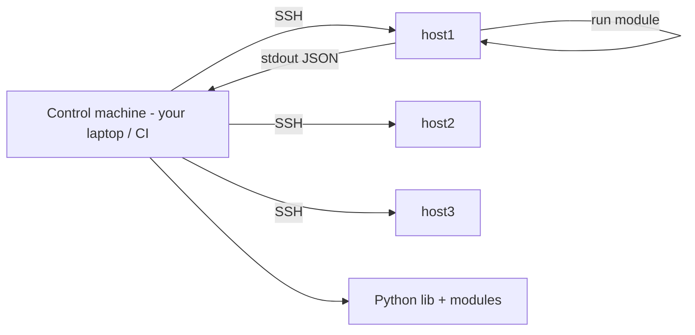

<KeyIdea>
**In one line**: Ansible pushes tasks over SSH — **no agent required**. Declarative, idempotent, repeatable — the smoothest tool for configuring tens to hundreds of machines.
</KeyIdea>

## What it is

`inventory.ini`:

```ini
[web]
web1 ansible_host=10.0.0.11
web2 ansible_host=10.0.0.12

[db]
db1 ansible_host=10.0.0.20

[all:vars]
ansible_user=ops
```

`site.yml`:

```yaml
- hosts: web
  become: true
  tasks:
    - name: install nginx
      apt: { name: nginx, state: present, update_cache: true }
    - name: configure nginx
      template:
        src: nginx.conf.j2
        dest: /etc/nginx/nginx.conf
      notify: reload nginx
    - name: start service
      service: { name: nginx, state: started, enabled: true }

  handlers:
    - name: reload nginx
      service: { name: nginx, state: reloaded }
```

```bash
ansible-playbook -i inventory.ini site.yml
ansible-playbook -i inventory.ini site.yml --check        # dry-run
ansible web -i inventory.ini -m shell -a 'uptime'         # ad-hoc
```

## Analogy

<Analogy>
SSH-ing to each machine = **handwriting letters one by one**;
broadcasting a shell script = **mass-mailing the same letter — typo means everyone gets the typo**;
Ansible = **HQ sends a parametric work-order with confirmation** — **already-done tasks aren't redone, completion is checked off, failures are logged and retryable**.
</Analogy>

## Key concepts

<Terms items={[
  { term: "Inventory", en: "Inventory", def: "Static ini/yaml or dynamic (cloud APIs, Tailscale, AWX)." },
  { term: "Module", en: "Module", def: "Ansible's actual workers (apt / file / template / service) — built-in idempotency." },
  { term: "Playbook", en: "Playbook", def: "Set of plays; each play binds hosts + tasks." },
  { term: "Role", en: "Role", def: "Reusable bundle of tasks/templates/files in a standard layout." },
  { term: "Handler", en: "Handler", def: "Conditionally-triggered task — reload only if config changed." },
  { term: "Vault", en: "ansible-vault", def: "Encrypts sensitive variables. CI needs the password to decrypt." },
  { term: "AWX / Tower", en: "GUI orchestration", def: "Web UI + RBAC + scheduling for enterprise use." },
]} />

## How it works



The control machine pushes module Python code to each host and executes it — **target only needs Python**.

## Practical notes

- **Idempotency is the floor** — when writing shell, add `creates:` / `removes:`; prefer modules (apt / file / template).
- **template + Jinja2** — render configs from variables. Pair with group_vars / host_vars for tiered overrides.
- **Roles** — bundle "install nginx + configure + start" into a role, reusable across playbooks.
- **`--check` + `--diff`** — dry-run + see exact changes.
- **Rollback** — Ansible has no built-in snapshots; manage playbooks in git and re-apply old values when needed.
- **Don't use Ansible as an SSH for-loop** — modules + idempotency beat hand-rolled shell.
- **Scale**: 1000+ hosts → mitogen / SSH multiplex / fact cache; or AWX for scheduling.
- **Secrets**: vault encryption + CI password injection; no plaintext commits.

## Easy confusions

<Compare
  leftTitle="Ansible"
  rightTitle="Chef / Puppet / Salt"
  left={<>
    Push (SSH) + agentless.<br />
    Zero target-side dependencies (Python).
  </>}
  right={<>
    Pull + persistent agent.<br />
    Suits thousands of nodes continuously converging.
  </>}
/>

## Further reading

- [Terraform / OpenTofu](/ops/ecosystem/terraform-opentofu) — for cloud resources
- [Linux speedrun](/ops/beginner/linux-quickstart)
- [SSH](/ops/beginner/ssh)
