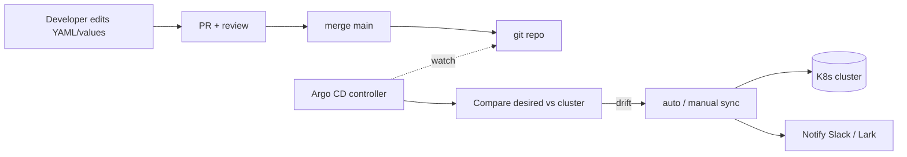

<KeyIdea>
**In one line**: Argo CD watches K8s manifests (raw YAML / Helm / Kustomize) in a git repo and **continuously syncs them to the cluster**. git push = deployed; manual cluster edits are detected / auto-reverted — the **declarative GitOps** model.
</KeyIdea>

## What it is

```yaml
# An Application is itself just YAML
apiVersion: argoproj.io/v1alpha1
kind: Application
metadata:
  name: web
  namespace: argocd
spec:
  project: default
  source:
    repoURL: https://github.com/me/infra
    path: apps/web
    targetRevision: main
    helm:
      valueFiles: [values-prod.yaml]
  destination:
    server: https://kubernetes.default.svc
    namespace: prod
  syncPolicy:
    automated: { prune: true, selfHeal: true }
    syncOptions: ["CreateNamespace=true"]
```

git push to update values → Argo CD syncs to the cluster within seconds.

## Analogy

<Analogy>
Without Argo CD = deploys are **going to the cluster with a hammer** — manual kubectl, results vary.
With Argo CD = **a built-in robot in the cluster** watches the git repo and reshuffles state to match.
</Analogy>

## Key concepts

<Terms items={[
  { term: "Application", en: "Application", def: "A set of K8s resources + source git path + target cluster/namespace." },
  { term: "AppProject", en: "AppProject", def: "Group of Applications + RBAC + allowed source repos / target clusters." },
  { term: "Sync policy", en: "Sync Policy", def: "manual / automated; automated splits into prune (drop resources missing from git) and selfHeal (revert manual changes)." },
  { term: "Drift", en: "Drift", def: "Cluster diverges from git. Argo flags it as OutOfSync." },
  { term: "Hook", en: "Sync hooks", def: "PreSync / PostSync / SyncFail — for migrations, notifications, etc." },
  { term: "ApplicationSet", en: "Dynamic application generation", def: "Generators (Git / List / Cluster) declare many Applications at once." },
  { term: "Argo Rollouts", en: "Progressive delivery", def: "Companion project — Canary / Blue-Green / traffic split, replaces Deployment." },
]} />

## Workflow



## Practical notes

- **GitOps golden rule**: **the cluster is read-only**. All changes go via git → CI → ArgoCD apply.
- **Suggested structure**: one repo for platform (CRDs / cluster-level), one for apps; or monorepo with directory isolation.
- **Helm + Kustomize both supported** — for complex setups use helmfile / `helm-include` / `kustomize`, whichever fits.
- **App of Apps**: one Application referencing many — a root manifest bootstrapping the whole cluster.
- **Multi-cluster**: one ArgoCD instance can drive many target clusters (different `destination.server` secrets).
- **Approvals / windows**: ApplicationSet + sync windows to gate production deploy times.
- **Secrets**: sealed-secrets / external-secrets / SOPS — only ciphertext in git.
- **Rollback**: `argocd app rollback web` or simply `git revert`.

## Easy confusions

<Compare
  leftTitle="Argo CD (GitOps)"
  rightTitle="GitHub Actions deploy step"
  left={<>
    Cluster pulls, **git is always the source of truth**.<br />
    Auto drift detection + self-healing.
  </>}
  right={<>
    Pipeline pushes, **event-driven**.<br />
    One-shot, no state-conservation notion.
  </>}
/>

## Further reading

- [CI/CD pipeline](/ops/advanced/cicd-pipeline)
- [Helm](/ops/advanced/helm)
- [Kubernetes core concepts](/ops/advanced/k8s-core)
