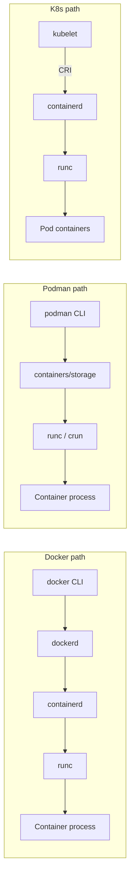

<KeyIdea>
**In one line**: **Docker** is the mass-market standard, **containerd** is the underlying runtime (K8s default), **Podman** is the daemonless, Docker-CLI-compatible alternative — **rootless-friendly**. All three are OCI-standard and interoperate.
</KeyIdea>

## What it is

```
What you type           What actually runs
docker run …  →  dockerd → containerd → runc → container process
podman run …  →  podman  →           containers/runc → container process  (no daemon)
crictl run …  →  containerd / CRI-O → runc                                (K8s-side)
```

**runc** is the small tool that actually invokes kernel namespace + cgroup syscalls to start the container — every layer above relies on it.

## Analogy

<Analogy>
**runc** = **the bricklayer**;
**containerd** = **the foreman** — manages workers, scheduling, timing;
**Docker / Podman** = **project manager + customer-facing rep** — you order at the CLI, they arrange.
</Analogy>

## Side-by-side

<KV items={[
  { k: "Docker Desktop / dockerd", v: "Needs a background daemon. Easiest for desktop / beginners." },
  { k: "Podman", v: "No daemon — single command forks the container. `alias docker=podman` is a near-drop-in. Rootless first-class." },
  { k: "containerd", v: "Default runtime for modern K8s (CRI-O too). Day-to-day with `crictl` / `nerdctl`." },
  { k: "K8s perspective", v: "Early K8s used dockershim; 1.24+ removed it — uses containerd / CRI-O directly." },
]} />

## How it works



## Practical notes

- **CLI compatibility** — Podman is nearly 100 % compatible with docker subcommands; replace it directly, no script changes.
- **Rootless default** — Podman and modern Docker (rootless mode) let unprivileged users run containers — safer.
- **Native Pod concept** — Podman has `podman pod`; multiple containers share a network — **same idea as K8s Pod**; `podman generate kube` exports YAML.
- **K8s no longer needs dockershim** — since 1.24, native containerd / CRI-O. **Image format is unchanged** (OCI), built artifacts remain compatible.
- **Single-host pick**: long-running single-host workloads → Podman + systemd quadlets is more "systemd-native" than dockerd.
- **Audit / compliance** — daemon-root constraints make Podman easier to certify than Docker.

## Easy confusions

<Compare
  leftTitle="Docker"
  rightTitle="Podman"
  left={<>
    Background dockerd daemon, root.<br />
    Most mature ecosystem.
  </>}
  right={<>
    Daemonless, rootless by default.<br />
    CLI-compatible, Pod-aware.
  </>}
/>

## Further reading

- [Docker basics](/ops/advanced/docker)
- [Kubernetes core concepts](/ops/advanced/k8s-core)
- [k3s / lightweight K8s distros](/ops/ecosystem/k3s-distros)
