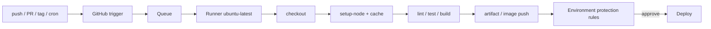

<KeyIdea>
**In one line**: GitHub Actions binds CI/CD to repository events — **push / PR / tag / schedule** all trigger workflows. Define them in `.github/workflows/`. **Free for public repos; private repos get a generous monthly quota**. Marketplace ecosystem is huge.
</KeyIdea>

## A typical workflow

```yaml
# .github/workflows/ci.yml
name: CI
on:
  push: { branches: [main] }
  pull_request:
permissions:
  contents: read
  packages: write
concurrency:
  group: ${{ github.workflow }}-${{ github.ref }}
  cancel-in-progress: true

jobs:
  test:
    runs-on: ubuntu-latest
    steps:
      - uses: actions/checkout@v4
      - uses: pnpm/action-setup@v3
      - uses: actions/setup-node@v4
        with: { node-version: 20, cache: pnpm }
      - run: pnpm install --frozen-lockfile
      - run: pnpm lint && pnpm typecheck && pnpm test
  build-image:
    needs: test
    if: github.ref == 'refs/heads/main'
    runs-on: ubuntu-latest
    steps:
      - uses: actions/checkout@v4
      - uses: docker/login-action@v3
        with:
          registry: ghcr.io
          username: ${{ github.actor }}
          password: ${{ secrets.GITHUB_TOKEN }}
      - uses: docker/build-push-action@v6
        with:
          push: true
          tags: ghcr.io/${{ github.repository }}:${{ github.sha }}
```

## Analogy

<Analogy>
GitHub Actions is **the muscle of your git repo** — push one line and it **dispatches a swarm of robots** doing QA + packaging + deploys.
</Analogy>

## Key concepts

<Terms items={[
  { term: "Workflow", en: "Workflow", def: "One per file in .github/workflows/*.yml." },
  { term: "Job", en: "Job", def: "Group of steps run on one runner. Multiple jobs run in parallel by default." },
  { term: "Step", en: "Step", def: "A command or Action. Actions are reusable community bundles (`uses:`)." },
  { term: "Runner", en: "Runner", def: "GitHub-hosted (`ubuntu-latest`) or self-hosted." },
  { term: "Secret / Variable", en: "Secret / Variable", def: "Repo / org / environment-level, injected as `${{ secrets.X }}`." },
  { term: "Environment", en: "Environment", def: "Adds protection rules (required reviewers / wait timers) — common gate for prod deploys." },
  { term: "Reusable / composite Action", en: "Reusable", def: "Extract shared steps into something callable from many workflows." },
]} />

## How it flows



## Practical notes

- **`concurrency` block** — subsequent pushes to the same ref auto-cancel the in-flight workflow, saving time and money.
- **Cache deps** — `actions/setup-node@v4` has `cache: pnpm/npm/yarn`; other languages use `actions/cache`.
- **OIDC for cloud deploys** — replaces long-lived keys. AWS / GCP / Azure all support OIDC trust; workflows mint short-lived credentials.
- **Tighten `permissions:`** — defaults narrow over time; declare per-job least-privilege.
- **Be careful with `pull_request_target`** — it has secret access and runs fork code = security landmine.
- **Matrix builds** — `strategy.matrix` runs across OSes / versions in one definition.
- **Tiered environment protection**: `environments/prod` with required reviewers, wait timers, mandated reviewers.
- **Self-hosted runners** — for big / private deps; **never** attach a self-hosted runner to a public-PR repo (code injection risk).

## Easy confusions

<Compare
  leftTitle="GitHub Actions"
  rightTitle="GitLab CI / CircleCI / Drone"
  left={<>
    Deeply integrated with GitHub.<br />
    Generous free tier, free for public repos.
  </>}
  right={<>
    GitLab-native / cross-platform SaaS / self-hosted.<br />
    Different ecosystems and pricing.
  </>}
/>

## Further reading

- [CI/CD pipeline](/ops/advanced/cicd-pipeline)
- [Argo CD](/ops/ecosystem/argocd)
- [Dockerfile](/ops/advanced/dockerfile)
