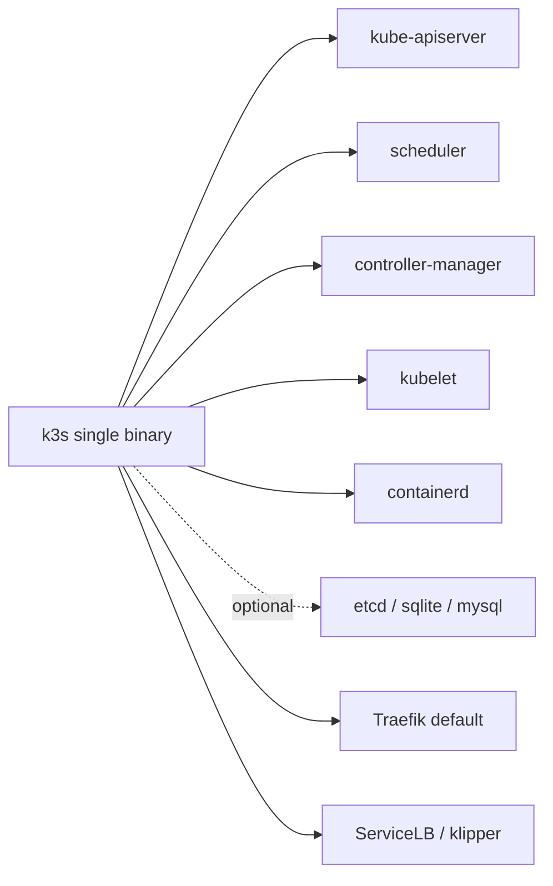

<KeyIdea>
**In one line**: vanilla K8s is heavy as a battleship; **k3s** packs the control plane into a single binary — **100 MB and one command** to install. Home labs / edge / IoT / single-host production: all viable.
</KeyIdea>

## One-line k3s install

```bash
# Master
curl -sfL https://get.k3s.io | sh -

# Auto-generated kubeconfig
sudo cat /etc/rancher/k3s/k3s.yaml

# Add a worker (get token from master)
curl -sfL https://get.k3s.io | K3S_URL=https://master:6443 \
  K3S_TOKEN=xxx sh -
```

`kubectl get nodes` just works — **etcd / control plane / kubelet are all in one binary**.

## Analogy

<Analogy>
Vanilla K8s is **a full IT department** — architects, DBAs, SREs, network engineers — fits big companies.
k3s is **a full-stack engineer** — one person doing everything; **small teams / personal / edge** are actually more nimble.
</Analogy>

## Mainstream lightweight distros

<KV items={[
  { k: "k3s (Rancher / SUSE)", v: "Single binary + sqlite/etcd + Traefik / ServiceLB defaults. Most popular." },
  { k: "k0s", v: "More 'zero-dependency' ethos; uses etcd or kine." },
  { k: "MicroK8s (Canonical)", v: "snap install, Ubuntu's own." },
  { k: "minikube / kind", v: "Local dev only — not production." },
  { k: "Talos Linux", v: "Treats K8s as the only app on bare metal; the whole OS is immutable." },
  { k: "RKE2 / EKS / GKE Autopilot", v: "Enterprise / cloud-managed." },
]} />

## How it works



## Practical notes

- **Batteries included**: Traefik / metrics-server / local-path / ServiceLB — works out of the box on a single host. Disable any with `--disable=traefik`.
- **Lightweight but really K8s**: API-compatible — Helm / kubectl / CRDs / Operators all work.
- **Datastore**: < 30 nodes → embedded etcd is fine; more → external etcd / mysql / postgres.
- **HA**: `--cluster-init` + ≥3 server nodes for control-plane HA.
- **Edge fleets**: Rancher Fleet / Cattle Drive manages hundreds of clusters via GitOps.
- **Home lab**: 3 Raspberry Pis + k3s + Tailscale = 100 % real production experience.
- **Upgrade**: `curl get.k3s.io | sh -s - --version v1.30.x` or system-upgrade-controller.

## Easy confusions

<Compare
  leftTitle="k3s"
  rightTitle="Vanilla K8s (kubeadm)"
  left={<>
    Single binary, low memory.<br />
    Production / edge / personal all fine.
  </>}
  right={<>
    Full component set — flexible but complex.<br />
    Big clusters / enterprise.
  </>}
/>

## Further reading

- [Kubernetes core concepts](/ops/advanced/k8s-core)
- [Helm](/ops/advanced/helm)
- [Argo CD](/ops/ecosystem/argocd)
