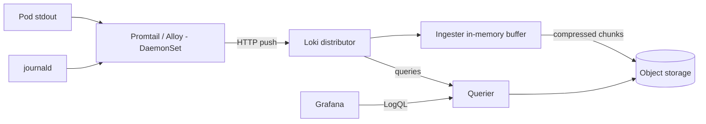

<KeyIdea>
**In one line**: Loki **indexes labels, not log bodies**, and stores chunks in object storage — about 10× cheaper than ES. Pair with Promtail / Vector / Alloy as collectors and Grafana with LogQL — **a perfect counterpart to Prometheus**.
</KeyIdea>

## What it is

```bash
helm install loki grafana/loki-stack \
  -n monitoring --set grafana.enabled=false \
  --set promtail.enabled=true
```

LogQL feels like PromQL:

```logql
{namespace="prod", app="web"} |= "error"
{app="web"} | json | status >= 500
sum(rate({app="web"} |~ "panic" [5m])) by (pod)
```

## Analogy

<Analogy>
ES = **a library indexing every word in every book** — powerful, expensive.
Loki = **only labels the spines** (shelf, author); narrow by label first **then crack a few books** — saves 80 % of the cost, covers 90 % of cases.
</Analogy>

## Key concepts

<Terms items={[
  { term: "Stream", en: "Stream", def: "A log stream uniquely identified by a label set (namespace + app + pod + ...)." },
  { term: "Label vs Filter", en: "Index vs filter", def: "Labels go in the index (control stream count). Body searched with `|=` / `|~` / `json` (not indexed)." },
  { term: "Chunks", en: "Chunks", def: "Loki compresses log chunks and stores them in object storage (S3 / GCS / R2 / MinIO)." },
  { term: "BoltDB-shipper / TSDB", en: "Index store", def: "Loki maintains its own lightweight indexes and uploads to object storage." },
  { term: "Promtail / Alloy / Vector", en: "Collector agents", def: "Per-node agents pushing logs to Loki. Alloy is the new unified agent." },
  { term: "Multi-tenant", en: "Multi-tenant", def: "`X-Scope-OrgID` header isolates tenant data." },
]} />

## How it works



Reads stream chunks back through the querier; **short queries fast, long-window queries slower but cheaper**.

## Practical notes

- **Don't add wild labels** — each value combination = a stream. **High-cardinality fields like pod_id / request_id must NOT be labels**; put them in the body and parse via `| json`.
- **JSON logs are a force-multiplier**: `{app="web"} | json | duration_ms > 500` — no regex.
- **Tier retention**: 7–14 days hot (block storage OK), 90 days cold (object storage only).
- **Alerting**: ruler can evaluate LogQL rules — error-log spikes alert via Alertmanager.
- **Complement / replace ELK**: many teams keep ES for product search and **shift ops logs to Loki** for cost.
- **Multi-cluster**: per-cluster Promtail → central Loki, or Mimir-style distributed Loki.
- **Large volumes**: use [bloom-shipper](https://grafana.com/docs/loki/latest/operations/storage/) to accelerate body searches.

## Easy confusions

<Compare
  leftTitle="Loki"
  rightTitle="Elasticsearch / OpenSearch"
  left={<>
    Label index + object storage.<br />
    Cheap, same mental model as Prometheus.
  </>}
  right={<>
    Full-text inverted index.<br />
    Powerful search / complex aggregation, **expensive**.
  </>}
/>

## Further reading

- [Log aggregation](/ops/advanced/log-aggregation)
- [Prometheus + Grafana](/ops/ecosystem/prometheus-grafana)
- [Log system (journalctl)](/ops/beginner/log-system)
