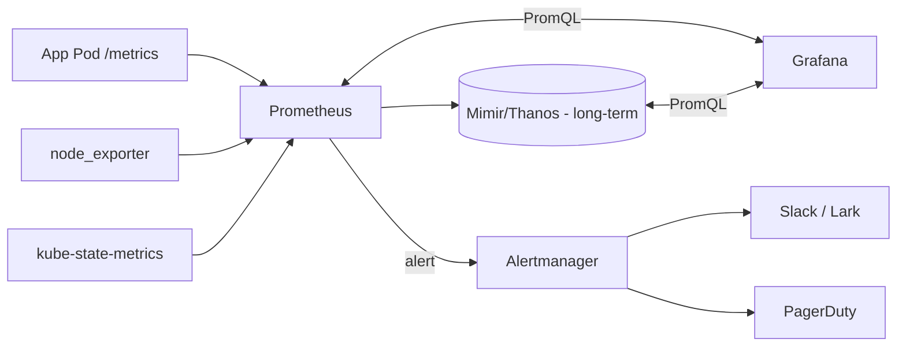

<KeyIdea>
**In one line**: Prometheus scrapes metrics + TSDB stores + Alertmanager alerts; Grafana visualizes. **kube-prometheus-stack** Helm chart installs everything — node-exporter / kube-state-metrics / cAdvisor — covering host + K8s + apps.
</KeyIdea>

## What it is

```bash
helm repo add prometheus-community https://prometheus-community.github.io/helm-charts
helm install monitoring prometheus-community/kube-prometheus-stack \
  -n monitoring --create-namespace
```

You get:

- **Prometheus** — metrics TSDB
- **Alertmanager** — alert grouping / silencing / routing
- **node-exporter** — host CPU / memory / disk / network
- **kube-state-metrics** — K8s object state
- **Grafana** — visualization + curated dashboards

## Analogy

<Analogy>
**Prometheus** = **the accountant** collecting and tallying;
**Grafana** = **the wall display** turning ledgers into charts;
**Alertmanager** = **the front-desk secretary** — calls / pings / messages you when numbers go off.
</Analogy>

## Key concepts

<Terms items={[
  { term: "ServiceMonitor / PodMonitor", en: "Scrape declarations", def: "Operator CRDs — express 'scrape these Pods / Svcs /metrics' as K8s objects." },
  { term: "Recording Rule", en: "Recording rule", def: "Periodically pre-compute expensive PromQL into new series — dashboards load fast." },
  { term: "Alert Rule", en: "Alert rule", def: "PromQL returning non-empty + `for: 5m` → fires." },
  { term: "Dashboard", en: "Dashboard", def: "Grafana JSON. Import official / community ones from grafana.com." },
  { term: "Datasource", en: "Datasource", def: "Prometheus / Loki / Tempo / MySQL — Grafana is the unified observability pane." },
  { term: "Long-term Storage", en: "Long-term Storage", def: "Prometheus stores 15 days locally by default. Mimir / Thanos / VictoriaMetrics provide long-term + multi-cluster federation." },
]} />

## How it works



## Practical notes

- **kube-prometheus-stack is the de-facto default** — install via Helm and you immediately get dashboards: `Kubernetes / Compute Resources / Node`, `Kubernetes / API server`, etc.
- **Alert severity levels**: critical (pages on-call) / warning (visible but no page) / info. **Don't make everything critical** — alert fatigue.
- **Inhibition rules**: when `Prometheus down`, suppress downstream `targets unreachable` so one outage doesn't fire dozens of alerts.
- **Silence (maintenance windows)**: create silence in Alertmanager before maintenance.
- **Persist PVs**: Prometheus needs PVC so pod restarts don't lose data; Grafana defaults to sqlite — switch to Postgres for HA.
- **Grafana SSO**: OAuth / OIDC for unified login.
- **Add Loki + Tempo as datasources**: logs + traces in the same Grafana — **metric → log → trace jumps in one click**.

## Easy confusions

<Compare
  leftTitle="Prometheus native storage"
  rightTitle="Mimir / Thanos / VictoriaMetrics"
  left={<>
    Local disk, **single node**.<br />
    Short retention (default 15 days).
  </>}
  right={<>
    Object storage, **horizontally scalable + multi-cluster**.<br />
    Retention from months to years.
  </>}
/>

## Further reading

- [Prometheus metrics model](/ops/advanced/prometheus-metrics)
- [Loki](/ops/ecosystem/loki)
- [Log aggregation](/ops/advanced/log-aggregation)
