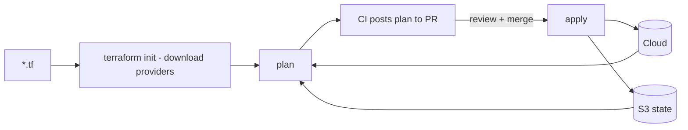

<KeyIdea>
**In one line**: Terraform is the IaC standard. After its 2024 license change to BSL (non-OSI), the community forked **OpenTofu** as a fully open-source alternative. **API-compatible** — migration is mostly swapping the binary name.
</KeyIdea>

## What it is

```hcl
terraform {
  required_providers {
    aws = { source = "hashicorp/aws", version = "~> 5.0" }
  }
  backend "s3" {
    bucket = "tfstate-prod"
    key    = "infra/main.tfstate"
    region = "us-east-1"
    dynamodb_table = "tfstate-lock"
    encrypt = true
  }
}

module "vpc" {
  source = "terraform-aws-modules/vpc/aws"
  name   = "prod"
  cidr   = "10.0.0.0/16"
  azs    = ["us-east-1a", "us-east-1b"]
}

resource "aws_s3_bucket" "media" {
  bucket = "media-prod-${random_id.suffix.hex}"
  force_destroy = false
}
```

```bash
terraform init
terraform plan -out=tfplan
terraform apply tfplan
```

## Analogy

<Analogy>
Pre-Terraform = **clicking around the cloud console + screenshots**.
Post-Terraform = **an IKEA instruction sheet** — anyone can reproduce **the exact same furniture**.
</Analogy>

## Key concepts

<Terms items={[
  { term: "Provider", en: "Cloud adapter", def: "AWS / GCP / Azure / Cloudflare / GitHub — almost every cloud resource has one." },
  { term: "Resource", en: "Resource", def: "A cloud object. Config is source of truth." },
  { term: "Data Source", en: "Data Source", def: "Read-only — query an existing cloud resource's attributes." },
  { term: "Module", en: "Module", def: "Reusable resource bundle, function-like." },
  { term: "Backend", en: "State backend", def: "S3 / GCS / Terraform Cloud. **Remote + lock** — required for multi-person collaboration." },
  { term: "Workspace / multi-env", en: "Workspace", def: "Same code, multiple states (dev/staging/prod). Directory separation is often clearer." },
  { term: "Plan", en: "Plan", def: "Computes diff without applying; CI posts it to PRs for review." },
]} />

## Workflow



The PR flow is the security cornerstone of IaC — **prod changes go through review**.

## Practical notes

- **Remote state + lock**: S3 + DynamoDB / GCS / Terraform Cloud / Spacelift. **Use it even solo** — future teammates cost nothing.
- **Modularize**: `modules/network/`, `modules/eks-cluster/` — reusable, testable.
- **Per-env directories**: `envs/prod/main.tf` referencing modules + overriding vars — more intuitive than workspaces.
- **Secrets via secret backends**: tfvars doesn't go to git, or use `vault_generic_secret` data source.
- **`prevent_destroy = true`** on prod DB / critical buckets — guards against accidental `destroy`.
- **Drift detection**: scheduled plan runs surface manual edits.
- **Switching to OpenTofu**: `opentofu init / plan / apply` — drop-in binary. Major new features may diverge over time.
- **Don't lump everything into one root** — multiple roots reduce blast radius.

## Easy confusions

<Compare
  leftTitle="Terraform / OpenTofu"
  rightTitle="Ansible"
  left={<>
    Manages **cloud objects**.<br />
    Create / modify / delete resources.
  </>}
  right={<>
    Manages **inside existing machines**.<br />
    Packages / files / services.
  </>}
/>

## Further reading

- [Infrastructure as Code](/ops/advanced/iac)
- [Ansible](/ops/ecosystem/ansible)
- [GitHub Actions](/ops/ecosystem/github-actions)
