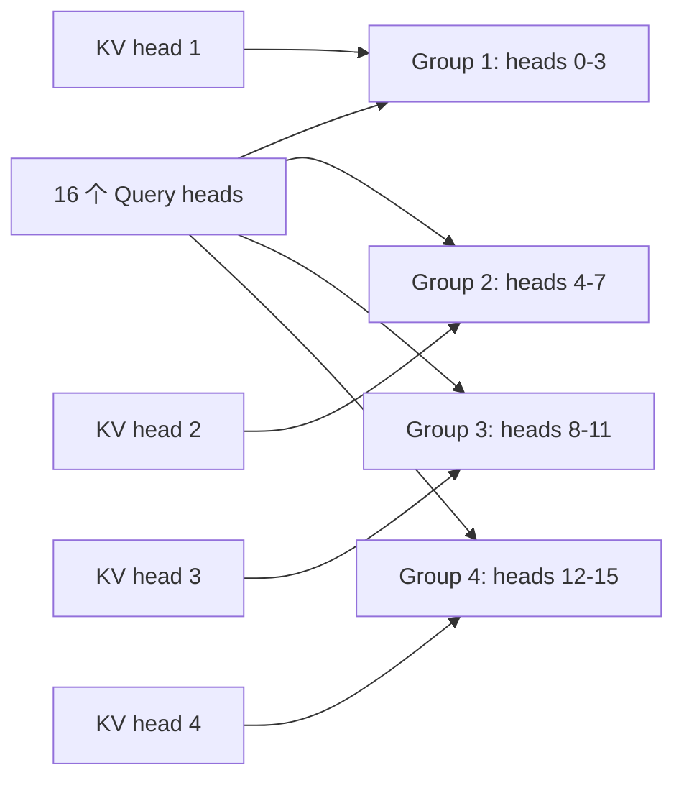

<KeyIdea>
**一句话**：标准 MHA 推理时 **KV cache 把显存带宽吃满**。MQA / GQA 让多个 query head 共享 KV，FlashAttention 把计算搬进 SRAM —— 三件套**让推理 / 训练都快好几倍**。
</KeyIdea>

## 标准 MHA 的瓶颈

每层每 token 都要把整段 KV cache 从 HBM 读到 SM。**长上下文时**：

- 显存带宽 ≫ 算力 → GPU 算单元闲着等数据；
- KV cache 大小 = `2 * L * H * d * dtype` 翻倍长度翻倍显存。

## 三大优化

<Terms items={[
  { term: "MQA", en: "Multi-Query Attention", def: "Q 多头，KV 只 1 套 → KV cache 缩到 1/H。质量略降，速度大涨。" },
  { term: "GQA", en: "Grouped-Query Attention", def: "MHA 与 MQA 折中：把 Q heads 分组，每组共享一份 KV。LLaMA-2/3、Qwen 等主流。" },
  { term: "FlashAttention", en: "块式 IO 优化", def: "把 Q/K/V 分块装进 SM 的 SRAM 里算 softmax，避免反复读 HBM。**算的更少不是关键**，**搬运变少**才是。" },
  { term: "PagedAttention", en: "vLLM 的内存管理", def: "把 KV cache 切成等大 page，按需分配 → 多请求 batch 利用率拉满。" },
  { term: "SWA", en: "Sliding Window Attention", def: "只看最近 N 个 token（Mistral）。配合 RoPE 外推。" },
  { term: "MLA", en: "Multi-Latent Attention", def: "DeepSeek-V2/V3 的低秩潜变量法 —— 进一步把 KV 压缩。" },
]} />

## 打个比方

<Analogy>
**MHA** 像**每位作家配独立图书馆员**（K/V 对）；  
**MQA** 像**全社共一名图书馆员** —— 快但不够细；  
**GQA** 像**几人合用一名图书馆员** —— 质量与速度双赢；  
**FlashAttention** 是**馆员把书搬到桌前一次性翻**，不再每查一次跑一趟书架。
</Analogy>

## 怎么工作（GQA）

KV head 数 = 4 而非 16 → KV cache 缩 4 倍。

## 实操要点

- **看模型卡找 num_key_value_heads**：少于 num_attention_heads 就是 GQA。LLaMA-3 8B：32 vs 8。
- **FlashAttention v2/v3** 几乎免费集成 —— PyTorch 2 的 SDPA、xformers、TransformerEngine 都自带。
- **长上下文**：靠 SWA + 位置编码外推（RoPE / NTK-aware / YaRN）+ 长上下文 SFT 数据三件套。
- **推理时 KV cache 占用估算**：`bytes ≈ 2 * 层数 * KV_heads * head_dim * seq_len * 2 (bf16)`。70B 模型 4k 上下文一般几个 GB。
- **量化 KV cache**：int8 / fp8 KV 进一步缩内存，**质量损失多在长上下文末端**。
- **自己微调大模型**：开 FlashAttention + LoRA + 8/4-bit 量化 → 单卡 24GB 也能跑 7B SFT。

## 易混点

<Compare
  leftTitle="算法层（MQA/GQA）"
  rightTitle="实现层（FlashAttention）"
  left={<>
    模型结构本身不同。 
    需要重训或重 init。
  </>}
  right={<>
    数学等价于 MHA，仅 IO 优化。 
    可即插即用换上去。
  </>}
/>

## 延伸阅读

- [Transformer 与 Attention](/ai/advanced/transformer)
- [KV Cache](/ai/advanced/kv-cache)
- [vLLM](/ai/ecosystem/vllm)
