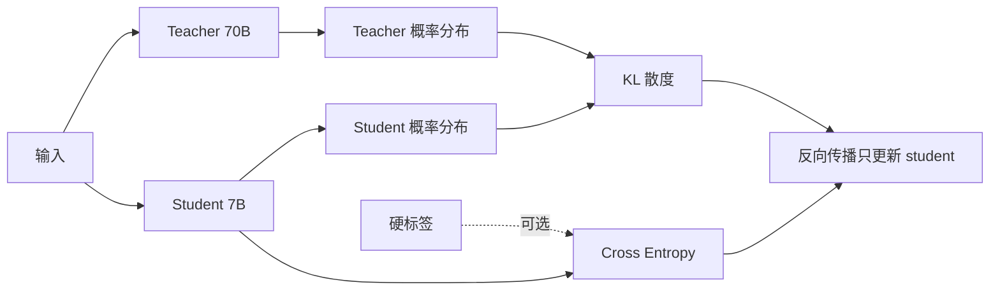

<KeyIdea>
**一句话**：蒸馏让小模型（**student**）模仿大模型（**teacher**）的输出 —— 不止学硬标签，还学**完整概率分布**。同等参数下蒸馏出的小模型比从零训练强很多。
</KeyIdea>

## 是什么

```
传统训练：    label "猫" → student 损失（一个对的）
KD 训练：    teacher 输出 [0.7 猫, 0.2 豹, 0.05 虎...] → student 模仿这个分布
```

学完整分布 = 学到了**类间关系**（猫和豹相似 > 猫和飞机），信息量大得多。

## 打个比方

<Analogy>
传统训练像**死记答案**：只知道「这道题选 B」。  
蒸馏像**老师讲思路**：B 最有可能、A 也合理但少了细节、C / D 直接错 —— 学生学到的是**思考路径**。
</Analogy>

## 关键概念

<Terms items={[
  { term: "Teacher / Student", en: "教师 / 学生", def: "Teacher 通常更大 / 更强，已训练好；Student 待训。" },
  { term: "Soft Targets", en: "软目标", def: "teacher 完整 softmax 概率（带温度）。比硬标签信息多。" },
  { term: "Temperature", en: "温度", def: "softmax 除以 T，T>1 让分布更平滑，类间差异显现。" },
  { term: "On-policy / Off-policy", en: "策略", def: "用 teacher 在 student 自己的输出上打分（更好）vs 在固定数据集上。" },
  { term: "Sequence Distillation", en: "序列级", def: "让 student 的输出**整体分布**逼近 teacher，而不是逐 token loss。" },
  { term: "Self-distillation", en: "自蒸馏", def: "Teacher = Student 早期版本，迭代精炼。" },
]} />

## 三种主流做法

<KV items={[
  { k: "经典 KD（Hinton 2015）", v: "KL(student || teacher) + α·CE(student, label)。" },
  { k: "Sequence-level KD", v: "Teacher 生成大量样本，student 用这些样本做 SFT。最常见。" },
  { k: "On-policy 蒸馏（DistillD）", v: "Student 自己产 token，teacher 给反馈。质量更好但贵。" },
]} />

## 怎么工作



只更新 student 的参数；teacher 固定。

## 实操要点

- **数据胜于损失**：99% 的实战是 **teacher 生成数据 → student SFT**。"软标签 KL" 在工程上不如多生成 1M 高质量样本。
- **领域选 teacher**：通用问题用 GPT-4 / Claude / DeepSeek-V3 蒸；垂直领域用领域专家模型。
- **思维链蒸馏**：让 teacher 输出带推理过程，student 学整个 CoT。Phi、Orca 系列就是这思路。
- **拒绝采样**：teacher 生成多份 → 自动校验 / 评分 → 留最好的喂 student。
- **小模型上限**：再蒸也不会超过 teacher。**别奢望 1.5B 完全等于 70B**，但能在某些子任务接近。
- **License 注意**：用商用 API 输出训自家模型，多数 ToS 禁止。开源模型（Qwen / DeepSeek / Llama）放宽得多但仍要看条款。

## 易混点

<Compare
  leftTitle="Distillation"
  rightTitle="Quantization"
  left={<>
    **改架构（变小）**。<br />
    需要训练。
  </>}
  right={<>
    **改精度（更省）**。<br />
    多数无需训练。
  </>}
/>

## 延伸阅读

- [SFT](/ai/advanced/sft)
- [Quantization](/ai/advanced/quantization)
- [RLHF](/ai/advanced/rlhf)
