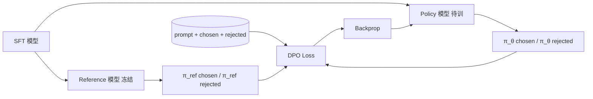

<KeyIdea>
**一句话**：DPO 把「学奖励 → PPO 优化」**两步合一步**，用一个分类损失直接拟合「**chosen 比 rejected 更好**」的偏好对。**实现简单 + 训练稳定**，是 RLHF 之后最受欢迎的对齐方法。
</KeyIdea>

## 是什么

数据集长这样：

```json
{
  "prompt": "解释什么是 GFW",
  "chosen": "GFW 是 ...（中立、详尽、客观）",
  "rejected": "GFW 是 ...（带情绪、片面）"
}
```

DPO 直接训：「让 chosen 在 model 上的概率比在 reference model 上高，比 rejected 高得越多越好」。

## 打个比方

<Analogy>
RLHF 像**先训一个评委 → 再让选手反复试 → 评委打分 → 改进**：步骤多、容易跑飞。  
DPO 像**直接给选手成对的范例**：「这两份哪一份更好」，**省掉评委**，少很多麻烦。
</Analogy>

## 关键概念

<Terms items={[
  { term: "Reference Model", en: "参考模型", def: "通常是 SFT 完的版本，固定不动。DPO 让模型偏向 chosen 但**不要偏离 ref 太远**。" },
  { term: "β", en: "KL 系数", def: "控制偏离 reference 的强度。大 β = 保守、小 β = 激进，调出有点像 RLHF 里的 KL coef。" },
  { term: "Pairwise", en: "成对偏好", def: "需要 chosen / rejected 对，**不需要绝对分数**。" },
  { term: "IPO / KTO / SimPO", en: "DPO 衍生", def: "对 DPO 损失的不同改进；KTO 不需要成对数据，只要 thumbs up / down。" },
  { term: "Iterative DPO", en: "迭代 DPO", def: "上一轮模型生成 → 评分 → 当下一轮偏好对 → 再 DPO，类似 RLHF 但更稳。" },
]} />

## 怎么工作



数学上等价于在隐式 reward `r = β log(π/π_ref)` 上做最大似然。

## 实操要点

- **数据质量 > 数据量**：1k 对高质量偏好优于 10k 对噪声数据。GPT-4 / Claude judge 可以拿来做自动比较。
- **从 SFT 开始**：DPO 在没 SFT 的 base 模型上效果差。先 SFT，再 DPO 是标配。
- **β 调参**：常见 0.1 ~ 0.5。先小步训 1 epoch，看 reward margin（chosen vs rejected）变化。
- **过拟合警告**：偏好对小数据集训太多 epoch → 模型过激，容易崩出怪话。
- **生产组合**：SFT → DPO → 安全 prompt 评测 → 推上线 / 再次迭代。
- **小模型也能 DPO**：LoRA + DPO 在 7B 模型 + 单卡 24GB 跑得起来，TRL / axolotl 框架开箱即用。

## 易混点

<Compare
  leftTitle="RLHF (PPO)"
  rightTitle="DPO"
  left={<>
    Reward Model + PPO。<br />
    强大但训练不稳。
  </>}
  right={<>
    一个分类损失。<br />
    简单稳定，效果接近 PPO。
  </>}
/>

## 延伸阅读

- [RLHF](/ai/advanced/rlhf)
- [SFT](/ai/advanced/sft)
- [Evaluation 与 Benchmark](/ai/advanced/evaluation)
