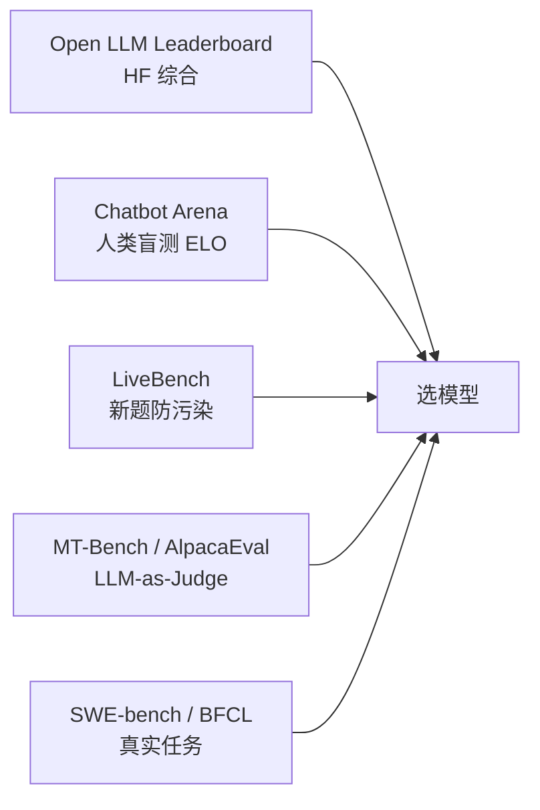

<KeyIdea>
**一句话**：模型评测有三大流派：**自动答题集**（MMLU / GSM8K / HumanEval）、**人类对战 / Arena**（Chatbot Arena）、**LLM-as-Judge**（用强模型当裁判）。任一单独都不够，要**混着看**。
</KeyIdea>

## 三大流派

<KV items={[
  { k: "Static Benchmarks", v: "MMLU、GSM8K、HumanEval、CMMLU、MATH 等。客观但易污染。" },
  { k: "Arena / 人评", v: "用户盲测两个模型回答 → 投票。Chatbot Arena ELO 是当前最权威之一。" },
  { k: "LLM-as-Judge", v: "用 GPT-4 / Claude 给两个回答打分。MT-Bench、AlpacaEval 用的是这套。" },
  { k: "针对性场景测试", v: "Tool use（BFCL）、长上下文（LongBench、RULER）、多语（CMMLU）、安全（Anthropic HH）等。" },
]} />

## 打个比方

<Analogy>
**Benchmark** 像**高考标准答题**：客观分数好对比，但**容易刷题**。  
**Arena** 像**辩论赛大众投票**：贴近真实使用，但**慢且贵**。  
**LLM-Judge** 像**让另一个学霸来打分**：快但**有偏见**（偏好啰嗦 / 长答案）。
</Analogy>

## 关键概念

<Terms items={[
  { term: "Pass@k", en: "通过率", def: "采样 k 次有 ≥1 次通过的概率。HumanEval / MBPP 用得多。" },
  { term: "ELO", en: "棋类评分系统", def: "Arena 用它对模型排名，每场胜负更新分数。" },
  { term: "Judge Bias", en: "裁判偏见", def: "GPT-4 偏好长答 + 自己家族 + 第一个出现的回答。需要交换位置 + position swap 平衡。" },
  { term: "Contamination", en: "数据污染", def: "测试题泄漏到训练集 → 分数虚高。HELM / MMLU 都遇到过。" },
  { term: "Holistic Eval", en: "综合评测", def: "HELM、Open LLM Leaderboard 综合多个维度算总分。" },
  { term: "End-to-end Task Eval", en: "真实任务评测", def: "SWE-bench（解决真实 GitHub issue）、AgentBench（Agent 任务）等更接近实用。" },
]} />

## 主流榜单一览

**只看一个榜单容易被刷题误导**，多榜对比更可靠。

## 实操要点

- **业务模型选型流程**：
  1. 看 Arena ELO + Open LLM Leaderboard 缩小候选；
  2. 用**自家测试集**做小流量 A/B；
  3. 让你的运营 / 产品当人评，不要只看自动分。
- **定制评测集**：写 50-200 道**贴你业务**的题（含边界 / 反人设 / 对抗）。模型一升级先跑这套。
- **防污染**：自己写题、加私有签名、定期换。
- **LLM-Judge 的对抗**：position swap（A 在前 / B 在前各跑一遍）+ 多 judge 投票（GPT-4o + Claude + DeepSeek）。
- **能力 ≠ 实用**：MMLU 90 不代表用得舒服。**「好用」很多时候是 RLHF + 输出风格 + 速度**而不是知识。

## 易混点

<Compare
  leftTitle="自动 Benchmark"
  rightTitle="人类评测 / Arena"
  left={<>
    可重复、便宜。 
    易刷题、易污染。
  </>}
  right={<>
    更接近真实使用。 
    慢、贵、噪声大。
  </>}
/>

## 延伸阅读

- [RLHF](/ai/advanced/rlhf)
- [DPO](/ai/advanced/dpo)
- [Prompt Injection](/ai/advanced/prompt-injection)
