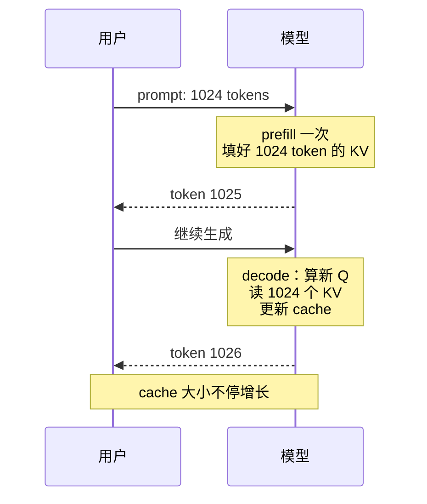

<KeyIdea>
**一句话**：自回归生成时，前面已计算好的 K / V 矩阵会被**缓存复用**，不必每生成一个 token 重算前文。但 cache **随上下文线性增长**，是长上下文推理的主要内存与带宽来源。
</KeyIdea>

## 是什么

生成第 N 个 token 时：

- 只需要算**新 token 自己**的 Q/K/V；
- 之前 N-1 个 token 的 K/V **从 cache 读**；
- 用新 Q 与全部 K 做 attention。

没有 cache → 每个新 token 都重算全部 → 复杂度 O(N²) 每步 → 总 O(N³)。  
有 cache → 每步 O(N) → 总 O(N²)。

## 打个比方

<Analogy>
KV cache 像**会议室的录音稿**：来一个新发言（token）只需录新这一段，前面发言**翻档案**就行；不用让所有人**再重说一遍**。
</Analogy>

## 大小估算

```
KV cache 字节数 ≈
   2 (K + V)
 × num_layers
 × num_kv_heads        // GQA / MQA 后的 KV head 数
 × head_dim
 × seq_len
 × dtype_bytes         // bf16 = 2, fp8 = 1, int4 = 0.5
```

LLaMA-3 70B、上下文 8K、bf16：

```
2 × 80 × 8 × 128 × 8192 × 2  ≈  2.7 GB
```

跑 batch 16 → 43 GB，**只 KV cache 就要专门一张卡**。

## 关键概念

<Terms items={[
  { term: "Prefill / Decode", en: "前缀阶段 / 解码阶段", def: "prefill 一次算所有 prompt（GPU 计算密集）；decode 一次一个 token（带宽密集）。" },
  { term: "PagedAttention", en: "分页缓存", def: "vLLM 把 cache 切成 16-token 一页，避免长度不齐造成碎片。" },
  { term: "Continuous Batching", en: "持续合批", def: "新请求到了立刻插进 batch 而不是等批结束 —— 吞吐翻倍。" },
  { term: "Prefix Cache", en: "前缀复用", def: "system prompt 公用 → KV 复用，节省 prefill 时间。" },
  { term: "KV 量化", en: "KV Quant", def: "int8 / int4 KV，压缩长上下文显存（精度有限损失）。" },
  { term: "Off-load", en: "下放", def: "长上下文 KV 放 CPU / NVMe，按需 swap 回 GPU（慢但能撑）。" },
]} />

## 怎么工作



## 实操要点

- **吞吐和延迟是两件事**：prefill 慢 = 首 token 等待长（TTFT）；decode 慢 = 每秒 token 数低（TPS）。优化点不同。
- **vLLM / TensorRT-LLM / SGLang** 已经把 PagedAttention + Continuous Batching + Prefix Cache 这些做完，**自己写推理一定打不过**。
- **超长上下文 (>32k)** KV cache 是主要瓶颈：考虑 KV 量化 / SWA（滑动窗口）/ RoPE 外推 + 局部+全局混合 attention。
- **system prompt 长**：开 prefix cache 让 N 个用户复用同一份 KV。
- **批量推理 OOM**：调小 max_seq_len 或 max_num_seqs，不要无限合批。
- **注意 batch=1 也省不了多少 KV**：KV 大小 ∝ seq_len，跟 batch 无关。

## 易混点

<Compare
  leftTitle="Prefill"
  rightTitle="Decode"
  left={<>
    一次性处理整个 prompt。<br />
    计算密集，能用大 batch。
  </>}
  right={<>
    每次一个 token。<br />
    带宽密集，**优化空间最大**。
  </>}
/>

## 延伸阅读

- [Attention 变体](/ai/advanced/attention-variants)
- [Speculative Decoding](/ai/advanced/speculative-decoding)
- [vLLM](/ai/ecosystem/vllm)
