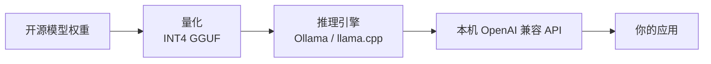

<KeyIdea>
**一句话**：本地推理 = **不调云 API，把模型权重下载下来在自己机器跑**。靠量化 + 高效推理引擎（llama.cpp / Ollama / vLLM），8B 模型笔记本秒跑，70B 量化版台式机能跑 —— **数据隐私、零 API 费、可离线**。
</KeyIdea>

## 是什么

完整链路：

```
1. 选一个开源模型 (Llama 3 / Qwen / DeepSeek)
2. 下载量化版 (.gguf / .safetensors)
3. 用推理引擎加载 (Ollama / llama.cpp / vLLM)
4. 通过 OpenAI 兼容 API 调用 → 完毕
```

`ollama run llama3` 一行命令，本机就有了能聊天的 LLM API。

## 打个比方

<Analogy>
- API 调用 = **去餐厅吃** —— 方便但要给钱、菜单受限。  
- 本地推理 = **自己买食材在家做** —— 麻烦但数据不出门、可以做特别口味、长期更便宜。
</Analogy>

## 关键概念

<Terms items={[
  { term: "GGUF", en: "GGUF 格式", def: "llama.cpp 主推的量化模型容器格式。CPU/GPU 通用。" },
  { term: "Inference Engine", en: "推理引擎", def: "llama.cpp / vLLM / SGLang / TGI / MLX —— 实际跑模型的程序。" },
  { term: "Tokens/sec", en: "吞吐", def: "衡量本地推理速度的关键指标。消费级 GPU 7B INT4 ≈ 50 tok/s。" },
  { term: "VRAM Footprint", en: "显存占用", def: "= 量化模型大小 + KV Cache。长 context 时 KV Cache 飞涨。" },
]} />

## 主流栈对比

| 工具 | 适合 | 特点 |
|---|---|---|
| **Ollama** | 个人 / 小团队 | 一行命令开箱即用，OpenAI API 兼容 |
| **llama.cpp** | 极致控制 / 嵌入式 | C++、最广硬件覆盖、GGUF 标准 |
| **LM Studio** | 桌面 GUI | 图形界面，新手友好 |
| **vLLM / SGLang** | 生产级服务 | 高吞吐、PagedAttention、batch |
| **MLX / Core ML** | Apple Silicon | M 系列芯片原生加速 |

## 怎么工作



应用代码完全可以**和云 API 一致** —— 只改 `OPENAI_BASE_URL` 指向本地。

## 实操要点

- **新手用 Ollama**：`ollama run llama3.1`、`ollama run qwen2.5`，**几分钟从零到能聊**。
- **看显存先看「模型大小 + 1–2 GB KV Cache」**：再加上系统本身。8GB 显存能跑 7B INT4，**12 GB 起跑 13B**，**24 GB 起摸 70B INT4**。
- **生产用 vLLM**：吞吐比 Ollama 高一个量级，**支持 paged KV cache + 持续批处理**。
- **MoE 模型对显存要求降一档**：14B 激活 / 总 47B 的 Mixtral 跑起来比 47B dense 便宜得多。
- **永远先跑量化版**：fp16 70B 需要 4×A100，量化 INT4 之后 1–2 张 4090 / 一台 mac studio 就能跑。

## 易混点

<Compare
  leftTitle="本地推理"
  rightTitle="云 API"
  left={<>
    数据**不出本机**。<br />
    一次性硬件成本 + 0 调用费。
  </>}
  right={<>
    **算力外包**给云厂。<br />
    随用随付、上限高。
  </>}
/>

<Compare
  leftTitle="本地推理"
  rightTitle="本地训练"
  left={<>
    只跑前向 → 显存压力**主要是 KV Cache**。
  </>}
  right={<>
    要存权重 + 梯度 + 优化器状态 —— **显存 ×3–5**。
  </>}
/>

## 延伸阅读

- [Quantization](/ai/advanced/quantization) —— 让本地推理可行的根技
- [LLM](/ai/beginner/llm) —— 应用层的「上面是什么」
- 工具：Ollama, LM Studio, llama.cpp, vLLM, MLX
