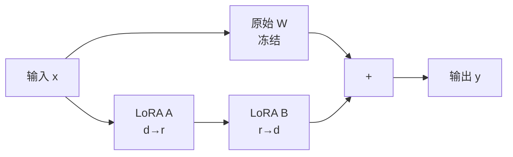

<KeyIdea>
**一句话**：LoRA = **Low-Rank Adaptation**。微调时**冻住原模型权重**，只训练插在每层旁边的两个**很小的低秩矩阵**。结果：参数减少 100–1000 倍、显存大幅降低、效果几乎不掉 —— 让普通开发者也能在一张消费级 GPU 上微调大模型。
</KeyIdea>

## 是什么

原模型的权重矩阵 W 是 d×d。LoRA 不改 W，而是给它加上一个旁路 `ΔW = B·A`，其中 A 是 d×r、B 是 r×d，r 通常取 4 / 8 / 16，**远小于 d**。

```
原始: y = W·x
LoRA: y = W·x + (B·A)·x   ← 训练时只更新 A、B
```

参数量从 d² 降到 2·d·r。**对一个 70B 模型，可微调参数从几百 GB 降到几百 MB**。

## 打个比方

<Analogy>
原模型 = **印好的厚厚一本书**。  
全参微调 = **把整本书重印一遍**，贵。  
LoRA = **在书上贴一些便利贴**，原书不动。要换风格？换一组便利贴就行 —— **多个 LoRA 可以热插拔**。
</Analogy>

## 关键概念

<Terms items={[
  { term: "Rank (r)", en: "秩", def: "LoRA 矩阵的「窄度」。常用 r=8 / 16，越大表达力越强、参数也越多。" },
  { term: "Alpha (α)", en: "缩放系数", def: "控制 LoRA 输出的放大倍数。常设 α=2r。" },
  { term: "Target Modules", en: "目标层", def: "通常给 attention 的 q/k/v/o 加 LoRA。也可加 FFN，开销更大。" },
  { term: "Adapter", en: "适配器", def: "训完的 LoRA 文件 —— 只有 A、B 两个矩阵，非常小（几 MB ~ 几百 MB）。" },
  { term: "Merge", en: "合并", def: "推理时可把 A·B 加进 W，等价于零额外开销。" },
]} />

## 怎么工作



**只有蓝色 A、B 训练，灰色 W 不动**。多个 LoRA 可以**为不同任务/风格**单独训练，运行时按需加载。

## 实操要点

- **r 不用调太大**：r=8 通常够用；上限 r=32。**调大 r 收益有限，但参数膨胀**。
- **学习率比全参微调大**：1e-4 ~ 3e-4 起步（相比 SFT 的 1e-5）。
- **量化 + LoRA = QLoRA**：把 base 模型量化到 4bit，LoRA 还在 fp16 上训。**70B 模型也能在单张 24GB 卡上微调**。
- **适配器可热切换**：一份 base + N 个 LoRA = N 个不同任务模型。**节省存储**。
- **目标层选对**：默认加 q/v 即可。**全部加 = 接近全参微调，反而失去 LoRA 优势**。

## 易混点

<Compare
  leftTitle="LoRA"
  rightTitle="Full Fine-tuning"
  left={<>
    **几百 MB** 参数。<br />
    单卡几小时。便宜灵活。
  </>}
  right={<>
    **几百 GB** 参数。<br />
    需要集群、贵。
  </>}
/>

<Compare
  leftTitle="LoRA"
  rightTitle="Prompt Tuning / P-Tuning"
  left={<>
    在**权重矩阵**上加旁路。<br />
    效果接近全参微调。
  </>}
  right={<>
    只训练 input 端的「**软 prompt**」。<br />
    更轻但效果通常弱一截。
  </>}
/>

## 延伸阅读

- [SFT](/ai/advanced/sft) —— LoRA 是 SFT 的高效实现
- [Quantization](/ai/advanced/quantization) —— QLoRA 把量化和 LoRA 结合
- 论文：「LoRA: Low-Rank Adaptation of Large Language Models」(Hu et al., 2021)
