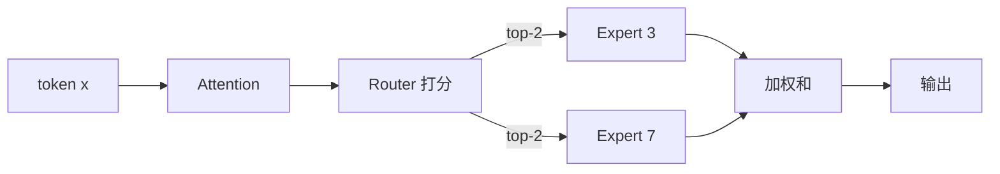

<KeyIdea>
**一句话**：MoE 让模型有 **N 个并列的专家 FFN**，但每个 token 只**路由**给少数几个（如 top-2）激活。**总参数量大** → 知识多；**激活参数小** → 推理便宜。
</KeyIdea>

## 是什么

传统 Transformer 每层一个大 FFN；MoE 把 FFN 替成"路由器 + 多个专家"：

```
Token → Router → 选 Top-K 专家 → 这几个专家算 → 加权求和 → 输出
```

DeepSeek-V3 671B 总参数，但每 token 只激活 ~37B —— **跑起来像 37B 模型**。

## 打个比方

<Analogy>
全 dense 模型 = **每道题问全班所有专家**：贵且很多专家其实没用。  
MoE = **教务处分流**：数学题分流给数学专家、写作题分流给写作专家 —— **总人数多**（知识广），**每题问的人少**（成本低）。
</Analogy>

## 关键概念

<Terms items={[
  { term: "Expert", en: "专家", def: "一个 FFN 子网络。一层有 8 / 64 / 256 个不等。" },
  { term: "Router / Gate", en: "路由器", def: "学到的小网络，输出每个专家的得分。" },
  { term: "Top-K", en: "选几个", def: "通常 top-2，只让得分最高的两个专家参与。" },
  { term: "Load Balance Loss", en: "负载均衡损失", def: "防止所有 token 涌向同一专家（坍缩），训练加辅助 loss。" },
  { term: "Shared Expert", en: "共享专家", def: "DeepSeek 等的设计：一部分专家始终激活承担通用知识。" },
  { term: "EP / TP", en: "并行策略", def: "Expert Parallelism 把不同专家放不同 GPU。通信代价是 MoE 训练难点。" },
]} />

## 怎么工作



权重是路由器算出来的得分（softmax）。

## 实操要点

- **总参数 ≠ 推理消耗**：看模型卡时区分 total / active params。Mixtral 8x7B → 47B total / ~13B active。
- **VRAM 仍然按 total 算**：所有专家都得装进显存（**激活不代表能省 RAM**）。**MoE 推理要的是大显存而非高算力**。
- **路由抖动**：对话上下文相似但路由不同 → 输出可能不稳定。常见 trick：top-k 提高、温度退火。
- **微调难点**：直接 SFT 容易破坏路由分布。可以冻结 router 只训专家，或上 LoRA 加在专家上。
- **分布式训练**：专家放不同卡 → all-to-all 通信占大头；Megatron-LM、DeepSeek 自家训练框架做了大量优化。

## 易混点

<Compare
  leftTitle="Dense Model"
  rightTitle="MoE Model"
  left={<>
    每 token 用全部参数。<br />
    简单、算力贵。
  </>}
  right={<>
    每 token 只用一部分。<br />
    内存大、算力省。
  </>}
/>

## 延伸阅读

- [Transformer 与 Attention](/ai/advanced/transformer)
- [Attention 变体（MQA/GQA/Flash）](/ai/advanced/attention-variants)
- [Quantization](/ai/advanced/quantization)
