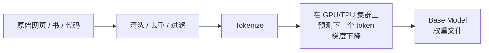

<KeyIdea>
**一句话**：预训练 = 在**几万亿 token** 的海量文本上做一个简单任务 —— **预测下一个 token**。这一步就让模型学会了语法、世界知识、推理框架，是后续所有微调、对齐工作的基础。
</KeyIdea>

## 是什么

数据：互联网网页 + 书 + 论文 + 代码 + 对话 + ...（清洗后约 10–15 TB 文本）。

任务：模型每看到一段话，就要**预测下一个词**：

```
输入: "The cat sat on the"
模型预测: "mat" (概率最高)
正确答案: "mat"  ← 损失 = 0
```

**几万亿次这种预测后**，模型在权重里压缩了「**语言怎么用 + 世界是怎样的**」 —— 这就是预训练完成的「Base Model」。

## 打个比方

<Analogy>
预训练像**让小孩读完整个图书馆** —— 没有人给他出题，**就让他不停地把书里下一句猜出来**。读够多书后，他自然学会语法、常识、修辞。  
之后的 SFT / RLHF 才是「**教他怎么礼貌答题**」。
</Analogy>

## 关键概念

<Terms items={[
  { term: "Next Token Prediction", en: "下一个词预测", def: "唯一的训练目标。简单 + 海量数据 = 涌现一切能力。" },
  { term: "Tokens Trained", en: "训练 token 数", def: "Llama 3 ≈ 15T，DeepSeek-V3 ≈ 14.8T —— 数量级直接决定能力上限。" },
  { term: "Compute", en: "训练算力", def: "用 FLOPs 衡量。Chinchilla 法则：参数 N 应配约 20N token 训练。" },
  { term: "Data Mixture", en: "数据配比", def: "网页 / 代码 / 数学 / 多语 / 长文档的比例，是各家秘方。" },
  { term: "Base Model", en: "Base 模型", def: "预训练完的「裸模型」，会续写但不会乖乖回答 —— 还要 SFT / RLHF。" },
]} />

## 怎么工作



预训练是**一次性、超贵的离线工程**：单次训练动辄数万 GPU·月、千万到上亿美元。

## 实操要点（应用视角）

- **应用工程师不会做预训练**：99.9% 的人**永远不需要从零训练** —— 用开源 base / chat 模型 + 微调即可。
- **理解「数据决定上限」**：模型懂不懂 Rust、写不写得好医学问答，全看预训练数据里有多少。**RAG / SFT 能补，但补不出底子**。
- **Base 模型 vs Chat 模型**：开源仓库通常两版都放 —— Base 适合自己 SFT，Chat 适合直接用。**搞混会很奇怪**。
- **关注训练 token 数**：「**用了多少 T token**」比「**多少 B 参数**」更能预测能力（Chinchilla / Llama 3 论文反复证明）。
- **不要在 prompt 里教语言**：预训练已经把语言学透 —— prompt 只需教**任务格式**，不必教语法。

## 易混点

<Compare
  leftTitle="Pre-training"
  rightTitle="SFT / Fine-tuning"
  left={<>
    海量**无标注**数据。<br />
    学语言 + 世界知识。
  </>}
  right={<>
    少量**标注好**数据。<br />
    教任务格式 / 风格。
  </>}
/>

<Compare
  leftTitle="Continued Pre-training"
  rightTitle="Pre-training"
  left={<>
    在已有 base 上**追加预训练**。<br />
    给特定语言 / 领域补料。
  </>}
  right={<>
    **从随机权重开始**。<br />
    最贵、最罕见。
  </>}
/>

## 延伸阅读

- [LLM](/ai/beginner/llm) —— 预训练的成品
- [SFT](/ai/advanced/sft) —— 预训练之后的「微调阶段」
- [RLHF](/ai/advanced/rlhf) —— 把模型「调成会说话」
- [Emergent Abilities](/ai/advanced/emergent-abilities) —— 预训练规模到一定程度的副产物
