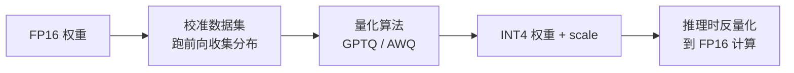

<KeyIdea>
**一句话**：量化 = 把模型权重 / 激活值的精度从 **fp16 / fp32 降到 int8 / int4 甚至更低**。一个 70B 模型 fp16 要 140GB，量化到 int4 只需 ~35GB —— **显存降 75%、推理加速 2–4 倍，智商几乎无损**。是把大模型「**塞进本地 / 边缘设备**」的关键技术。
</KeyIdea>

## 是什么

模型权重原本是浮点数：

```
fp16: 0.123456    (2 字节)
int8: 16          (1 字节,  ÷2)
int4: 2           (0.5 字节, ÷4)
```

每个权重用更少的 bit 表示，**精度变粗但占用变小**。推理时再恢复大致数值，**误差控制得当时模型表现下降很小**。

## 打个比方

<Analogy>
全精度 = **小数点后 7 位的精确食材** —— 厨师能区分 0.1234 g 和 0.1235 g。  
量化 = **改用「克」做最小单位** —— 大部分菜尝不出区别。  
**量化质量好的菜，盲测和原版几乎一样**。
</Analogy>

## 关键概念

<Terms items={[
  { term: "FP32 / FP16 / BF16", en: "浮点精度", def: "训练用 BF16 / FP16 是主流。FP32 几乎只在校准时用。" },
  { term: "INT8 / INT4 / 2bit", en: "整数精度", def: "推理常见。INT4 是「容量 vs 质量」的甜点。" },
  { term: "PTQ", en: "训练后量化", def: "Post-Training Quantization —— 模型训完后再量化。最常见。" },
  { term: "QAT", en: "量化感知训练", def: "训练时就模拟量化误差。质量更好但要重训。" },
  { term: "GGUF / AWQ / GPTQ", en: "量化格式", def: "GGUF (llama.cpp 主流)，AWQ / GPTQ 是 PTQ 算法 + 格式。" },
]} />

## 显存对比

| 模型 | FP16 | INT8 | INT4 |
|---|---|---|---|
| 7B  | 14 GB | 7 GB | **3.5 GB** |
| 13B | 26 GB | 13 GB | **6.5 GB** |
| 70B | 140 GB | 70 GB | **35 GB** |
| 175B | 350 GB | 175 GB | **88 GB** |

INT4 通常是消费级硬件的临界 —— **24GB 4090 跑 70B INT4 都能勉强上**。

## 怎么工作



智能算法（AWQ / GPTQ）会**保留对模型最重要的少数权重高精度**，把次要权重降到 INT4，**质量损失最小**。

## 实操要点

- **优先选 GGUF + Q4_K_M**：llama.cpp 生态最广、量化质量好、CPU/GPU 都能跑。**绝大多数本地部署的默认选择**。
- **数据敏感任务慎用低精度**：编程、数学、长链推理对量化敏感。**先 INT8 看效果，再决定 INT4**。
- **跑 benchmark 比看分数靠谱**：「量化损失 1%」是平均值，**你的具体任务可能掉 5%**。用自己的测试集跑一遍。
- **量化 + LoRA = QLoRA**：训练时模型 INT4，LoRA 适配器 FP16。**70B 单卡可微调**。
- **服务化用 vLLM + AWQ / GPTQ**：吞吐 + 显存利用率比 GGUF 高。**大流量首选**。

## 易混点

<Compare
  leftTitle="Quantization"
  rightTitle="Distillation"
  left={<>
    同一模型、**变低精度**。<br />
    保留所有结构。
  </>}
  right={<>
    训练一个**更小的模型**。<br />
    结构变了，行为靠老师教。
  </>}
/>

<Compare
  leftTitle="PTQ"
  rightTitle="QAT"
  left={<>
    **训完再量化**。<br />
    简单、快、主流。
  </>}
  right={<>
    **训练时就模拟量化**。<br />
    质量稍好、但要重训，少用。
  </>}
/>

## 延伸阅读

- [Local Inference](/ai/advanced/local-inference) —— 量化的最终落地场景
- [LoRA](/ai/advanced/lora) —— QLoRA 把二者结合
- 工具：llama.cpp / Ollama / LM Studio / vLLM
