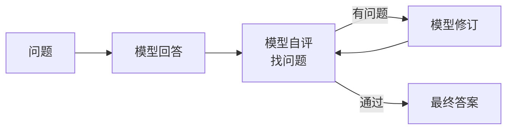

<KeyIdea>
**一句话**：Reflection = **让模型审视自己的回答**：「**这答得对吗？哪里可能错？**」如果不满意就重写。是把「单次推理」变成「**写 → 改 → 写**」迭代过程的最便宜套路。
</KeyIdea>

## 是什么

```
Round 1:
  问题: 写一段 SQL 查 Q3 销售前 5 的城市
  回答: SELECT city, SUM(amount)... ORDER BY amount LIMIT 5

Round 2 (Reflection):
  审视: 这条 SQL 缺 GROUP BY，运行会报错。
  
Round 3:
  改写: SELECT city, SUM(amount) ... GROUP BY city ORDER BY ...
```

**同一个模型自己当批改员**。多花一次调用，错误率往往掉一半。

## 打个比方

<Analogy>
人写作文也是「**写完通读一遍**」 —— 第一遍直觉，第二遍挑刺、第三遍改。  
Reflection = 把这一套写进 prompt，让模型**对自己的输出做 code review**。
</Analogy>

## 关键概念

<Terms items={[
  { term: "Self-Critique", en: "自我批评", def: "用 prompt 让模型挑自己输出的毛病：「这里哪里可能错？」" },
  { term: "Verifier", en: "验证器", def: "可以是同一个模型、另一个更强模型，或外部工具（编译器 / 测试）。" },
  { term: "Iteration", en: "迭代", def: "「写 → 评 → 改」可以跑 N 轮直到通过 —— 通常 1–3 轮就够。" },
  { term: "Reflexion", en: "Reflexion 算法", def: "把过去的失败原因写进「memory」，下次决策时引用。强化版 Reflection。" },
]} />

## 怎么工作



每条横线都是一次 LLM 调用，**额外开销可控**。

## 实操要点

- **「自评」prompt 要具体**：「**列出 3 个最可能的错误，再判断要不要改**」比「检查一下」效果好得多。
- **验证器越客观越好**：能跑测试 / 编译器 / 计算器的任务**优先用工具验证**，模型自评有「**自吹自擂**」偏差。
- **迭代次数封顶**：1–3 轮通常够，再多边际收益骤降，**还容易越改越乱**。
- **Reflection > Sampling N 次再投票（很多任务里）**：相同 token 成本下，Reflection 通常比朴素 self-consistency 强。
- **关键应用必上**：写代码、数学题、跑 SQL、长文档总结 —— **这些场景错了代价大，多一次反思值回票价**。

## 易混点

<Compare
  leftTitle="Reflection"
  rightTitle="Self-Consistency"
  left={<>
    **批评 + 改写**。<br />
    串行 N 轮，每次基于上次。
  </>}
  right={<>
    **多次独立采样**再投票。<br />
    并行 N 条，互不影响。
  </>}
/>

<Compare
  leftTitle="Reflection"
  rightTitle="Tool-based Verify"
  left={<>
    模型**自己评**自己。<br />
    成本低、但可能漏检。
  </>}
  right={<>
    用**编译器 / 测试 / 计算器**验证。<br />
    客观可靠，能用就用。
  </>}
/>

## 延伸阅读

- [ReAct](/ai/beginner/react) —— Reflection 常常嵌进 ReAct 循环
- [CoT](/ai/beginner/cot) —— Reflection 是「先 CoT 答 + 再 CoT 评」
- [ToT](/ai/advanced/tot) —— 评估这一步类似 ToT 的剪枝
