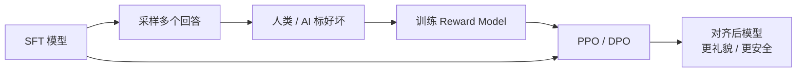

<KeyIdea>
**一句话**：RLHF = **Reinforcement Learning from Human Feedback**。让人类比较模型两条回答的好坏，**训练一个「偏好打分器」（Reward Model）**，再用强化学习推动 LLM 向「**人类喜欢的方向**」微调。这是 ChatGPT 当年「**突然变好用**」的关键一步。
</KeyIdea>

## 是什么

三步骤：

1. **SFT** —— 先用人类示范数据 SFT，得到一个会乖乖答的模型。
2. **训 Reward Model** —— 同一问题让模型采样多个回答，**人类标「哪个更好」**，训一个能给任意回答打分的小模型。
3. **PPO / DPO 微调** —— 用强化学习让原模型最大化 reward，**同时不偏离 SFT 模型太远**（KL 约束）。

跑完后模型「**懂分寸、不胡说、有礼貌**」 —— 这是「Alignment（对齐）」的工业落地方法。

## 打个比方

<Analogy>
SFT = 教孩子**怎么答题**。  
RLHF = 老师**给两份答卷打分**：「这份比那份好」 —— 孩子慢慢学会**老师的评分标准**，不是死记答案。
</Analogy>

## 关键概念

<Terms items={[
  { term: "Reward Model (RM)", en: "奖励模型", def: "一个分类 / 回归模型，输入 (问题, 回答)，输出一个分数。" },
  { term: "Preference Data", en: "偏好数据", def: "成对样本 (chosen, rejected) —— 数万条人工标注或 LLM 当 judge。" },
  { term: "PPO", en: "Proximal Policy Optimization", def: "RLHF 的经典 RL 算法。复杂、贵、要 4 个模型同时跑。" },
  { term: "DPO", en: "Direct Preference Optimization", def: "2023 年提出 —— 直接拿偏好数据训练 LLM，不需要单独 RM 和 PPO。" },
  { term: "RLAIF", en: "AI 反馈 RL", def: "用强模型当 judge 替代人工标注，省钱不少。" },
]} />

## 怎么工作

实际生产里 **DPO** 已经是事实标准 —— 工程复杂度比 PPO 低一个量级。

## 实操要点

- **应用工程师几乎不做 RLHF**：除非你在做基座模型 / 做安全对齐。**绝大多数业务用开源对齐过的模型 (Llama-Instruct / Qwen-Chat) 就够**。
- **真要做选 DPO**：5–20k 条偏好数据，单卡几小时跑完。比 PPO 简单。
- **偏好数据可以「半 AI」**：用 GPT-4 当 judge 标 9k 条，然后再让人审 1k 条 —— **质量 + 成本平衡最好**。
- **小心「过度对齐」**：模型变得**啥都不敢答**。要在偏好数据里**加入「合理拒绝 vs 过度拒绝」**对照。
- **理解为什么 ChatGPT 比 base 强**：base 模型是会续写的「文本怪兽」，**RLHF 把它训成「能用的产品」**。

## 易混点

<Compare
  leftTitle="RLHF"
  rightTitle="SFT"
  left={<>
    **比较好坏** —— 学评分标准。 
    能压制「ish 回答」。
  </>}
  right={<>
    **模仿示范** —— 学具体答法。 
    没法表达「这样答比那样答好」。
  </>}
/>

<Compare
  leftTitle="DPO"
  rightTitle="PPO"
  left={<>
    **直接用偏好数据**训 LLM。 
    简单、稳、便宜。当前主流。
  </>}
  right={<>
    **训 RM + 在线采样 + RL**。 
    复杂、贵、容易崩。
  </>}
/>

## 延伸阅读

- [Pre-training](/ai/advanced/pre-training) → [SFT](/ai/advanced/sft) → RLHF —— 现代 LLM 三段式训练
- [Hallucination](/ai/beginner/hallucination) —— RLHF 的副作用之一是减少幻觉
- 论文：「Training language models to follow instructions with human feedback」(InstructGPT, 2022)
