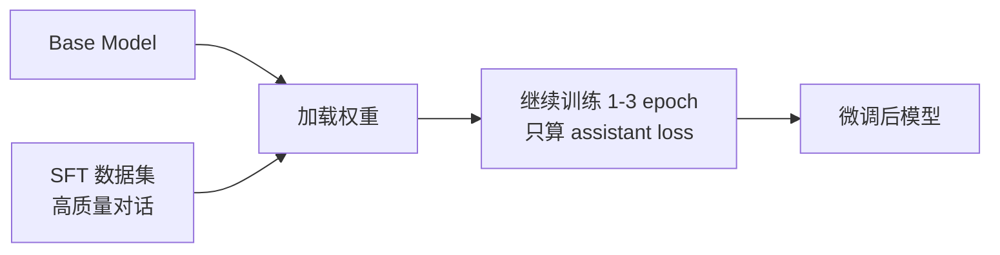

<KeyIdea>
**一句话**：SFT = **Supervised Fine-Tuning**，准备一批 `{用户输入, 期望回答}` 数据，**用同样的「next-token prediction」让模型学会照这种格式回答**。是把 base model 调成「**会按你想要的方式说话**」的最直接方式。
</KeyIdea>

## 是什么

数据是这样的：

```jsonl
{"messages":[{"role":"user","content":"什么是 LLM?"},
             {"role":"assistant","content":"LLM 是大语言模型..."}]}
{"messages":[{"role":"user","content":"帮我退款"},
             {"role":"assistant","content":"好的，请提供订单号..."}]}
```

模型在这些对话上**继续训练几个 epoch**，loss 只算 assistant 回答那部分。**几千条高质量对话**就能把 base 模型调成「客服风格」「医学风格」「品牌人设」。

## 打个比方

<Analogy>
预训练 = **读完图书馆**，会语言。  
SFT = **拿一摞「优秀范文」给他临摹** —— 他学的是「**这种问题要这种答**」的模式。  
不是让他知道更多，是让他**会按你的样子答**。
</Analogy>

## 关键概念

<Terms items={[
  { term: "Instruction Tuning", en: "指令微调", def: "SFT 的早期叫法 —— 用「指令-回答」对让模型听话。" },
  { term: "Quality > Quantity", en: "质量优于数量", def: "1k 条精挑细选 ≫ 100k 条凑数。LIMA 论文证明。" },
  { term: "Loss Mask", en: "损失屏蔽", def: "只在 assistant 输出 token 上算 loss，忽略 user 部分。" },
  { term: "Catastrophic Forgetting", en: "灾难性遗忘", def: "微调过头会丢失通用能力。要么数据混合 / 要么少 epoch。" },
]} />

## 怎么工作



技术上和预训练**一模一样**（也是 next-token prediction），区别只在**数据规模 + loss mask**。

## 实操要点

- **数据质量是 90% 的事**：花一周打磨 1000 条数据，**比花一个月凑 100k 噪声数据效果好**。
- **优先用 LoRA**：除非有大显卡集群，否则直接做全参 SFT 太贵。**LoRA 在小卡上几小时就能调**。
- **学习率比预训练小**：1e-5 ~ 5e-5 起步。**调大极容易把 base 调傻**。
- **混入通用数据防遗忘**：1:1 加一些通用对话数据，**否则模型只会答你训练任务**，其他全报废。
- **先 prompt + few-shot 试**：能用 prompt 解决就别 SFT。**SFT 工具链复杂、迭代慢**，prompt 能改一句话。

## 易混点

<Compare
  leftTitle="SFT"
  rightTitle="RLHF"
  left={<>
    **模仿优秀回答**：教模型「这样答」。
  </>}
  right={<>
    **比较好坏**：用偏好数据让模型「**避开烂回答**」。
  </>}
/>

<Compare
  leftTitle="SFT"
  rightTitle="RAG"
  left={<>
    把知识 / 风格**烧进权重**。<br />
    更新要重新训练。
  </>}
  right={<>
    把知识**临时塞 prompt**。<br />
    更新就改资料库。
  </>}
/>

## 延伸阅读

- [Pre-training](/ai/advanced/pre-training) —— SFT 的前一步
- [LoRA](/ai/advanced/lora) —— SFT 的低成本实现
- [RLHF](/ai/advanced/rlhf) —— SFT 的下一步：对齐
