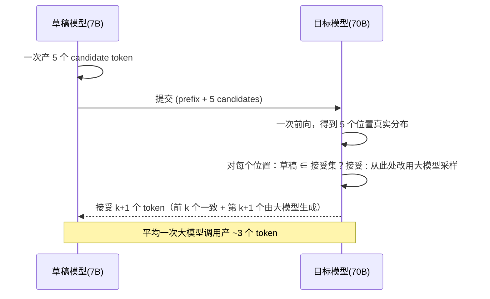

<KeyIdea>
**一句话**：让一个**轻量草稿模型**一次性猜 K 个 token，再让**大模型并行验证**这 K 个；接受的部分一次拿下、不接受的从分歧点继续。**数学上输出分布与原来完全等价**，但快 2-3 倍。
</KeyIdea>

## 是什么

```
传统 decode：每生成 1 个 token，调用大模型 1 次

Spec decode：
  小模型一口气提 5 个 token
  大模型一次前向（KV 增量）→ 拿到这 5 个位置的真实概率
  逐位置校验：和小模型一致就接受，否则从分歧点改用大模型这次的输出
  平均一次大模型调用产出 2-4 个 token
```

## 打个比方

<Analogy>
草稿模型像**实习生先把会议纪要写好**，大模型像**主管一次性审 5 段** —— 大部分能直接 OK，只改不通过的部分。**主管批量审**比**自己一句一句写**快得多。
</Analogy>

## 关键概念

<Terms items={[
  { term: "Draft Model", en: "草稿模型", def: "小且快的模型（往往是同家族的小版本，如 Llama-3 8B 当 70B 的草稿）。" },
  { term: "Verification Step", en: "验证一步", def: "把 K 个候选 token 送进大模型一次前向，**拿到 K 个位置的真实概率**。" },
  { term: "Acceptance Rate", en: "接受率", def: "草稿和大模型一致的比例。50%-80% 是常见区间。" },
  { term: "Lossless", en: "无损", def: "采样分布严格等价 —— 用拒绝采样数学保证。" },
  { term: "Medusa / Eagle / Lookahead", en: "无草稿模型方法", def: "用模型自身多头预测多个未来 token，省掉单独草稿模型。" },
  { term: "Self-speculative", en: "自投机", def: "同一模型用早期层做草稿、全模型验证。" },
]} />

## 怎么工作



## 实操要点

- **接受率高的关键**：草稿和目标模型分布相似（同家族同 RLHF 流派最佳）。
- **草稿模型小到合适**：太大反而慢；通常**目标模型的 1/10 ~ 1/30**。
- **温度高 / 采样发散** → 接受率下降，加速比变小。低温 / 贪心生成时 spec decode 加速最猛。
- **vLLM / TGI / TensorRT-LLM** 都内置 spec decode 选项（自动选 medusa / draft model）。
- **服务化时**：可以多请求共享草稿，进一步省算力。
- **不要拿来追求质量**：spec decode **数学上和原始 decode 一致**，质量不会涨也不会跌。

## 易混点

<Compare
  leftTitle="Speculative Decoding"
  rightTitle="Quantization / Distillation"
  left={<>
    **不改模型权重**，纯推理加速。<br />
    数学等价，**输出不变**。
  </>}
  right={<>
    **改权重**（精度 / 大小）。<br />
    输出会有微小差异。
  </>}
/>

## 延伸阅读

- [KV Cache](/ai/advanced/kv-cache)
- [Quantization](/ai/advanced/quantization)
- [vLLM](/ai/ecosystem/vllm)
