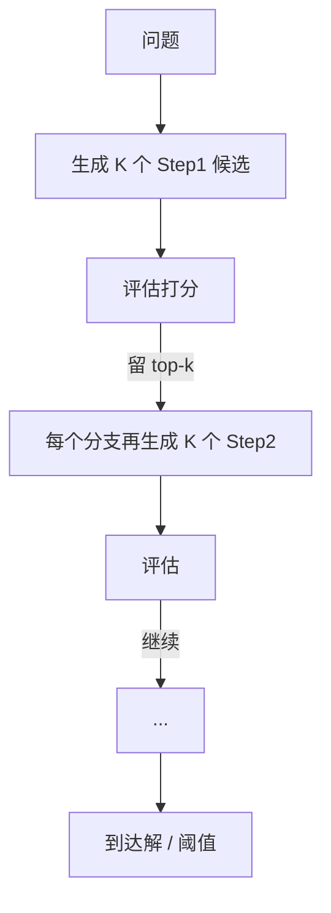

<KeyIdea>
**一句话**：ToT = **Tree of Thoughts**，把推理过程想象成一棵树。每一步**让模型生成多个候选思路**，对每个思路打分，**只沿最有希望的分支继续展开** —— 用「**搜索 + 评估**」替代 CoT 的「单条直觉链」。
</KeyIdea>

## 是什么

CoT 是直线：

```
Step1 → Step2 → Step3 → Answer
```

ToT 是分叉树：

```
Step1 ┬─ A1 (评分 0.7) ─┬─ A1a (0.9) ✓
      ├─ A2 (评分 0.4)  └─ A1b (0.3) ✗
      └─ A3 (评分 0.6)
```

每层生成 N 个候选 → 让模型（或外部裁判）打分 → 只展开 top-k → 继续 → 走到叶子节点选最优路径。

## 打个比方

<Analogy>
- CoT = **走迷宫一直闷头走**，错了就走到死。  
- ToT = **走到岔路停一下，假想三条路各走两步，估一估哪条更通**，再决定走哪条。  
**树搜索**这一招在国际象棋 / Go 里早就常用 —— ToT 是把它套进 LLM 推理。
</Analogy>

## 关键概念

<Terms items={[
  { term: "Thought", en: "思路节点", def: "树里一个推理步骤的中间状态 —— 一段自然语言。" },
  { term: "Generator", en: "生成器", def: "Prompt 让模型一次产 K 个不同候选思路。" },
  { term: "Evaluator", en: "评估器", def: "另一段 prompt（或同一模型）给候选打分 / 投票。" },
  { term: "Search Strategy", en: "搜索策略", def: "BFS / DFS / Beam Search —— 决定怎么遍历这棵树。" },
]} />

## 怎么工作



实质 = **「LLM 当节点 + 自评作为 heuristic」的树搜索**。

## 实操要点

- **任务要适合**：数独、24 点、规划、长链证明 —— 这种**有明确解 / 评估可验证**的问题 ToT 收益大。开放式写作没必要。
- **Token 成本爆炸**：N 层 × K 候选指数级开销 —— 实际只用 2–3 层、每层 3–5 个候选。
- **评估器要设计好**：用「**confident / not confident / sure**」三档投票，比让模型直接打分更稳。
- **替代方案先试**：很多场景 **CoT + Self-Consistency**（采样 5–10 条 CoT 再投票）就够好，**比 ToT 简单一个量级**。
- **生产里少用裸 ToT**：往往用 ReAct + 部分回溯 / Reflection 替代 —— 工程更可控。

## 易混点

<Compare
  leftTitle="ToT"
  rightTitle="CoT"
  left={<>
    **多路径 + 搜索**。<br />
    适合有解的难题，贵。
  </>}
  right={<>
    **单路径直觉**。<br />
    便宜、覆盖大部分场景。
  </>}
/>

<Compare
  leftTitle="ToT"
  rightTitle="Self-Consistency"
  left={<>
    构建**显式树结构**，每层评估剪枝。
  </>}
  right={<>
    **独立采样 N 条**完整 CoT 再投票。<br />
    实现简单，效果常常接近。
  </>}
/>

## 延伸阅读

- [CoT](/ai/beginner/cot) —— ToT 的简化前身
- [Reflection](/ai/advanced/reflection) —— 在 ReAct 里加「自评」也能近似 ToT 收益
- 论文：「Tree of Thoughts」 (Yao et al., 2023)
