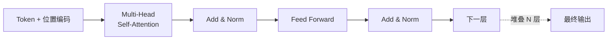

<KeyIdea>
**一句话**：Transformer 是 2017 年提出的神经网络架构，靠 **Self-Attention（自注意力）**让序列里每个 token 都能「**看一眼所有其它 token**」并算出它们对自己的重要性。今天 GPT / Claude / Gemini / DeepSeek 全是它的变种。
</KeyIdea>

## 是什么

Transformer 之前用 RNN/LSTM —— 句子要**逐字喂**进去，长距离依赖学不好。Transformer 把整个序列**一次性**喂进去，每个 token 用 Attention 算出「**和我相关的其他 token 是哪些**」：

```
"The cat sat on the mat because it was tired"

it 在算自己时:
  - the:  0.02
  - cat:  0.83  ← 高
  - sat:  0.05
  - mat:  0.04
  - tired: 0.06
```

模型直接看到 `it` 指 `cat` —— **长距离依赖不再衰减**。

## 打个比方

<Analogy>
RNN = **接力赛跑** —— 信息一棒一棒传，越远丢得越多。  
Transformer = **圆桌会议** —— 所有词同时上桌，每个词环顾全场后**自己决定该听谁的发言**。
</Analogy>

## 关键概念

<Terms items={[
  { term: "Self-Attention", en: "自注意力", def: "每个 token 算自己 query 与所有 token key 的相似度，加权聚合 value。核心公式 softmax(QK/√d)V。" },
  { term: "Multi-Head", en: "多头", def: "并行跑 N 套 attention，每头学不同关系（语法 / 语义 / 指代）。" },
  { term: "Positional Encoding", en: "位置编码", def: "Attention 本身不分顺序，要额外注入位置信息（绝对 / 相对 / RoPE）。" },
  { term: "FFN", en: "前馈层", def: "Attention 之后接的 MLP —— 模型容量主要在这里，MoE 也是改它。" },
  { term: "Decoder-Only", en: "仅解码器", def: "GPT 系列用的简化变体：只有自回归生成，不需要 encoder。" },
]} />

## 怎么工作



每个 Transformer Block = `Attention → FFN`，**叠 N 层**。GPT-4 级别约 100+ 层。

## 实操要点（应用层视角）

- **应用工程师不必复现，但要懂瓶颈**：每多一倍 context window，**Attention 的计算和内存增长 ≈ 平方** —— 这是为什么长上下文贵。
- **优化都围着 Attention 转**：FlashAttention（IO 优化）、KV Cache（推理时复用）、GQA / MQA（多 query 共享 KV）—— 推理性能提升基本都来自这里。
- **Position Encoding 决定外推**：RoPE / ALiBi 这类相对位置能让模型在「**训练时 4K，推理外推到 128K**」。
- **Decoder-Only 是当前霸主**：BERT 那种 encoder-only 用于检索 / 分类；生成式应用 99% 是 decoder-only。
- **要算多大显存？**：参数量 × bytes_per_param + KV Cache (≈ batch × seq × layers × heads × head_dim × 2)。**长 context 时 KV Cache 经常比参数更吃显存**。

## 易混点

<Compare
  leftTitle="Encoder-Only"
  rightTitle="Decoder-Only"
  left={<>
    BERT —— 双向看上下文。<br />
    擅长理解 / 分类 / 检索。
  </>}
  right={<>
    GPT —— 只能左到右生成。<br />
    擅长开放式生成对话。
  </>}
/>

## 延伸阅读

- [LLM](/ai/beginner/llm) —— 应用视角的「黑箱」
- [Context Window](/ai/beginner/context-window) —— Attention 计算的物理上限
- [Quantization](/ai/advanced/quantization) —— 如何把 Transformer 跑得起来
- 必读论文：「Attention Is All You Need」(2017)
