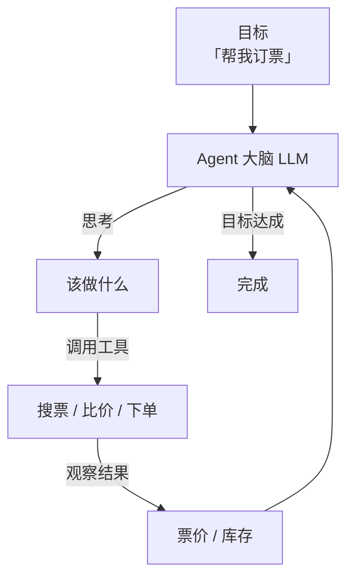

<KeyIdea>
**一句话**：Agent 是一个**能感知环境、自主决策、会调用工具、迭代解决问题**的 AI 系统 —— 而不只是「一问一答」的聊天机器人。
</KeyIdea>

## 是什么

Chatbot 只会回答你一轮话；Agent 会把**「一个目标」**拆成任务，边做边看结果，**自己决定下一步**。它至少有 4 个要素：

1. **大脑**（LLM） —— 做决策
2. **工具**（Tools） —— 拿外部数据、执行动作
3. **记忆**（Memory） —— 保留上下文和历史
4. **循环**（Loop） —— 想 → 做 → 看 → 再想，直到完成

## 打个比方

<Analogy>
Chatbot 像**餐厅前台**：你问什么它答什么。  
Agent 像**实习生**：你说「订一张明天去上海的高铁票」，它会自己查时刻表、比较价格、点「预订」、填姓名、付款、最后把 PDF 发你 —— 中间**不用你一步步指挥**。
</Analogy>

## 关键概念

<Terms items={[
  { term: "LLM Core", en: "大脑", def: "所有决策都是 LLM 生成的 —— 它是 Agent 的中央处理器。" },
  { term: "Tools", en: "工具", def: "搜索、浏览器、代码解释器、API 调用…… Agent 伸向外部世界的「手」。" },
  { term: "Planning", en: "规划", def: "把大目标拆成小步骤，是 Agent 和 Chatbot 的分水岭。" },
  { term: "Memory", en: "记忆", def: "短期（Context Window）+ 长期（向量库 / DB），让 Agent 跨会话工作。" },
  { term: "Loop", en: "循环", def: "ReAct 等范式让模型多轮迭代 —— 没有循环就只是 one-shot 助手。" },
]} />

## 怎么工作

本质上，Agent = **LLM + 工具 + 循环**。其余架构都是在这三件上做加法。

## 实操要点

- **先想清楚「循环终止条件」**：是模型自己说 done？还是达到步数上限？没想清楚 Agent 会**无限烧钱**。
- **工具描述比工具本身重要**：模型能不能正确选工具，95% 取决于工具的 `description` / 参数 schema 写得好不好。
- **短路强于全自主**：能在 prompt 里写死的流程（比如「先搜，再分析，最后总结」）就不要让模型临场想 —— 更稳更便宜。
- **Observability 必须先上**：每一步的「想 / 做 / 看」都要记 trace，出了问题才能 debug。否则 Agent 就是黑盒。

## 易混点

<Compare
  leftTitle="Chatbot"
  rightTitle="Agent"
  left={<>
    一问一答，无状态。 
    不调工具，不能做事。
  </>}
  right={<>
    多步循环，有记忆。 
    调工具、改世界、交付结果。
  </>}
/>

<Compare
  leftTitle="Agent"
  rightTitle="Workflow"
  left={<>
    **模型决定**下一步做什么。 
    灵活但不可控。
  </>}
  right={<>
    **人预先定义**节点和流转。 
    稳定但不会临场发挥。
  </>}
/>

## 延伸阅读

- [ReAct](/ai/beginner/react) —— Agent 最核心的「想-做-看」范式
- [Planning](/ai/beginner/planning) —— 把大任务拆成小步骤的能力
- [Multi-Agent](/ai/beginner/multi-agent) —— 多个 Agent 协作
- [Workflow](/ai/beginner/workflow) —— 和 Agent 互补的「确定性流转」方案
