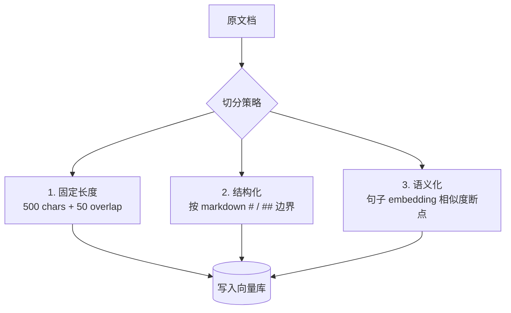

<KeyIdea>
**一句话**：Chunking = 把一份长文档**切成几百到几千字一块的片段**。RAG 是按 chunk 检索 + 喂模型的 —— 所以**怎么切、切多大、有没有重叠**，几乎决定了 RAG 上限。
</KeyIdea>

## 是什么

一篇 50 页 PDF 不能整个扔进向量库（一是太长 embedding 失焦，二是检索回来塞不进 context）。常见做法：

```
原文档: 50 页 PDF (50,000 字)
   ↓ Chunking
chunk_001: 第 1 段, 500 字
chunk_002: 第 2 段, 500 字 (与 chunk_001 重叠 50 字)
...
chunk_120: 第 120 段, 500 字
```

每个 chunk 单独做 embedding、单独被检索、单独被喂模型。

## 打个比方

<Analogy>
查百科全书没人**整本背回去**。  
你会**翻到「最相关的那几页」** —— Chunking 就是预先把书切成「页」，**每页一张语义指纹**，按指纹找页。
</Analogy>

## 关键概念

<Terms items={[
  { term: "Chunk Size", en: "块大小", def: "200–800 字常见。太小丢上下文，太大稀释主题。" },
  { term: "Overlap", en: "重叠", def: "相邻 chunk 共享一些字 (10–20%)，避免话题被切断。" },
  { term: "Splitter", en: "切分策略", def: "按字符 / 按 token / 按句 / 按段 / 按 markdown 标题…" },
  { term: "Metadata", en: "元数据", def: "每个 chunk 附带 doc_id / 章节标题 / 页码 —— 检索后能溯源。" },
]} />

## 三种主流策略



- **固定长度**：最简单，FlashCards / 论坛问答适用。
- **结构化**：有清晰标题层级的文档（书、API doc）首选 —— **天然把语义边界保住**。
- **语义化** (Semantic Chunking)：相邻句子 embedding 距离突变处切 —— 效果最好但贵。

## 实操要点

- **先按结构切，再考虑长度**：H1/H2/H3、列表、表格 —— 这些天然边界**不要打断**。
- **chunk size 跟着模型 + embedding 调**：embedding 模型通常 512 token 是甜点，超过会被截断。
- **每个 chunk 拼上「祖先标题」**：`# 第三章 - ## 退款政策 - chunk 内容`。**检索 + 生成时都极有帮助**。
- **小文档别切**：&lt;2000 字直接整篇当一个 chunk，**少切少噪声**。
- **可以双粒度索引**：句子级 chunk 用于召回，**取回后扩展上下文**到所在段落 / 章节再喂模型。

## 易混点

<Compare
  leftTitle="Chunking"
  rightTitle="Tokenizing"
  left={<>
    **应用层**：把长文切成「段」(几百字)。
  </>}
  right={<>
    **模型层**：把字符切成「token」(子词)。<br />
    完全不同抽象层。
  </>}
/>

## 延伸阅读

- [RAG](/ai/beginner/rag) —— Chunk 服务的最终目的
- [Embeddings](/ai/beginner/embeddings) —— 每个 chunk 都要 embedding
- [Vector Database](/ai/beginner/vector-db) —— Chunk 的家
