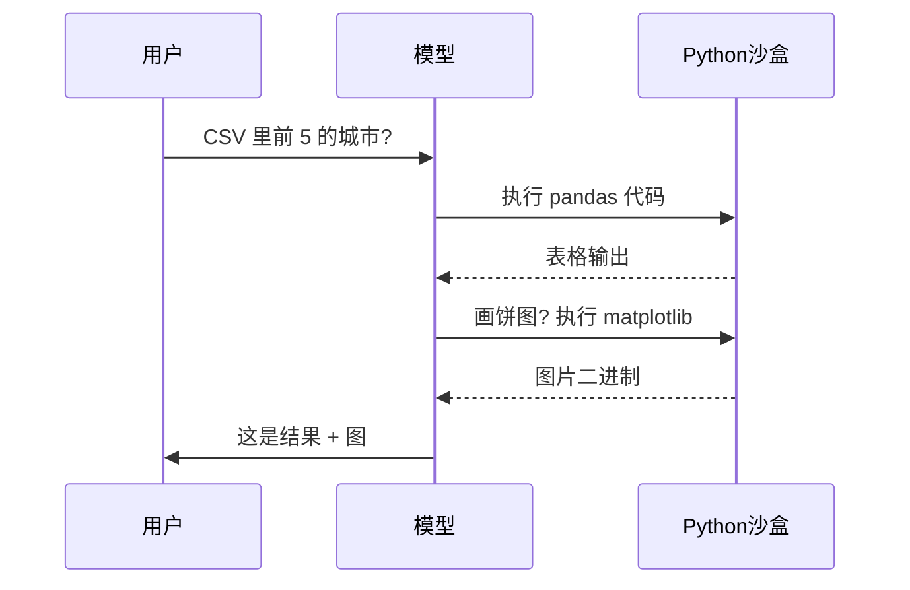

<KeyIdea>
**一句话**：Code Interpreter 是一个**让模型「写代码 + 跑代码 + 看结果」**的沙盒环境（默认是 Python）。模型遇到要算数、读文件、画图、跑数据时，**生成代码、运行、看输出，再继续推理** —— 把不靠谱的「心算」交给可靠的「计算机」。
</KeyIdea>

## 是什么

工作流程：

```
用户: 这个 CSV 文件里销售额前 5 的城市是哪些？

模型: [生成 Python 代码]
import pandas as pd
df = pd.read_csv("/mnt/data/sales.csv")
print(df.groupby("city")["amount"].sum().nlargest(5))

执行: [代码在沙盒里跑]
city
Beijing     1234567
Shanghai     987654
...

模型: 销售额前 5 的城市是 …（基于真实结果回答）
```

模型**自己决定要不要写代码、写什么代码**，沙盒负责安全执行，结果回喂模型。

## 打个比方

<Analogy>
LLM 心算 = 一个**特别会胡说**的人帮你算账。  
Code Interpreter = 给他**一台计算器**和草稿纸 —— 他遇到数字就**真的算一下**，结果就靠谱了。
</Analogy>

## 关键概念

<Terms items={[
  { term: "Sandbox", en: "沙盒", def: "隔离的容器 / VM / WebAssembly。模型代码在里面跑，不能碰主机。" },
  { term: "Stateful Kernel", en: "持续 kernel", def: "Jupyter 风格 —— 变量在多轮调用之间保留，不必每次重读文件。" },
  { term: "File I/O", en: "文件挂载", def: "用户上传的文件挂在沙盒里 (`/mnt/data/`)，模型读 / 写都行。" },
  { term: "Output", en: "输出回写", def: "stdout / 异常 / 图表都被捕获并喂回模型。" },
]} />

## 怎么工作



模型把「执行结果」当 observation 接着推理，**和 ReAct 是同一个套路**。

## 实操要点

- **优先派给数学 / 数据 / 文件**：算账、统计、转格式、画图、跑回归 —— 都让 Code Interpreter 干，**比硬聊天精确十倍**。
- **沙盒安全**：**永远禁止** 网络、SSH、读敏感目录。**给最小权限**，能跑数据分析就够了。
- **kernel 复用 vs 新起**：长会话保持同一 kernel 省时间，**但变量污染要小心**。多用户产品建议每人独立 kernel。
- **超时 + 资源限制**：CPU / 内存 / 执行时间 / 输出大小都要 cap，**避免模型生成死循环把机器打满**。
- **失败要详细回喂**：抛异常时把 traceback 完整喂回模型，它会**根据错误改代码重试** —— 这是 Code Interpreter 真正强的地方。

## 易混点

<Compare
  leftTitle="Code Interpreter"
  rightTitle="普通 Function Calling"
  left={<>
    模型**临时编代码**解决问题。<br />
    无限灵活，但风险高、需沙盒。
  </>}
  right={<>
    **预定义工具**集合，模型只会调。<br />
    可控，但每个新能力要先写好工具。
  </>}
/>

<Compare
  leftTitle="Code Interpreter"
  rightTitle="Code Generation"
  left={<>
    **写 + 执行**：模型在沙盒跑代码看结果。
  </>}
  right={<>
    **只写**：把代码交给用户，自己不跑。<br />
    Cursor / Copilot 默认是这种模式。
  </>}
/>

## 延伸阅读

- [Function Calling](/ai/beginner/function-calling) —— Code Interpreter 是一个特殊的「工具」
- [Hallucination](/ai/beginner/hallucination) —— 用 Code Interpreter 现场算来压幻觉
- [ReAct](/ai/beginner/react) —— 「想 + 跑代码 + 看结果」也是 ReAct 循环
