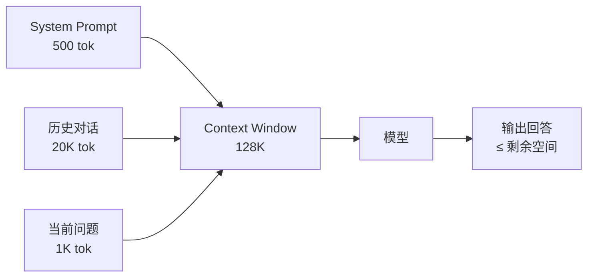

<KeyIdea>
**一句话**：Context Window 是模型一次推理能「**看见**」的 Token 总数 —— 系统提示 + 历史对话 + 当前问题 + 模型回答，**全部加起来不能超过这个上限**。超过就会被截断。
</KeyIdea>

## 是什么

每个模型有固定的 Context Window 大小，常见数字：

| 模型 | Context Window |
|---|---|
| GPT-3.5 | 16K |
| GPT-4o | 128K |
| Claude 3.7 / Sonnet 4.5 | 200K |
| Gemini 2.5 Pro | 1M – 2M |
| Qwen3-Long | 1M |

**它是输入 + 输出的总和**，不是只算输入。

## 打个比方

<Analogy>
Context Window 就像模型面前那张「**便利贴**」 —— 它只看得到便利贴上的文字。塞得下的部分模型「记得」，塞不下就**当作没见过**。
</Analogy>

## 关键概念

<Terms items={[
  { term: "输入 Token", en: "Prompt", def: "system + 历史对话 + 用户问题 + 工具结果。" },
  { term: "输出 Token", en: "Completion", def: "模型这一轮要生成的回答 + 工具调用 JSON。" },
  { term: "总和上限", en: "Hard Limit", def: "输入 + 输出 ≤ Context Window。超了就报错或截断。" },
  { term: "有效注意力", en: "Effective Recall", def: "上限不等于「都能用」—— 长上下文里中间部分常被忽略，叫「Lost in the Middle」。" },
]} />

## 怎么工作

如果 system + 历史已经吃了 120K，模型最多只能再生成 **8K Token**。

## 实操要点

- **算总账**：长对话要算 system + 历史 + 当前 + 预期输出，**任何一个超量都会失败**。
- **裁剪历史**：旧消息可以压缩成摘要再保留，比硬删除好。
- **关键信息放两端**：开头几百 Token 和最近几百 Token 的注意力最强。中间会「失忆」。
- **不是越长越好**：Context 越长，**速度更慢、价格更高、有效记忆下降**。能用 RAG 解决就别硬塞。

## 易混点

<Compare
  leftTitle="Context Window (短期)"
  rightTitle="Long-term Memory (长期)"
  left={<>
    模型本次推理在内的 Token 上限。 
    会话结束就**全部消失**。
  </>}
  right={<>
    跨会话保存信息（向量库 / 数据库）。 
    用 RAG 之类的机制**临时调入** Context。
  </>}
/>

<Compare
  leftTitle="Context Window"
  rightTitle="Parameters"
  left={<>
    一次能看多少 Token —— **运行时**容量。
  </>}
  right={<>
    模型权重数量 —— **结构性**容量。 
    跟 context 大小**无关**。
  </>}
/>

## 延伸阅读

- [Token](/ai/beginner/token) —— 上下文窗口度量的单位
- [Short-term Memory](/ai/beginner/short-term-memory) —— 多轮对话里如何管理 Context
- [RAG](/ai/beginner/rag) —— 突破 Context 上限的标准答案
