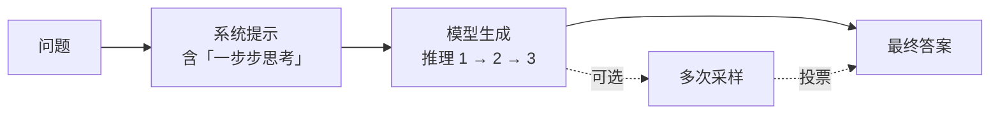

<KeyIdea>
**一句话**：CoT 就是**让模型把推理过程「写出来」再下结论**。只多一句「请一步一步思考」，数学、逻辑、多步推理任务的正确率常常能翻倍 —— 这是 prompt engineering 里最赚的一招。
</KeyIdea>

## 是什么

**没有 CoT**（模型一步到位）：

> Q: 小明有 12 个苹果，给了 1/3 给小红，又买了 5 个，现在多少？  
> A: **17**  ❌（错）

**有 CoT**（一步一步写出来）：

> Q: 小明有 12 个苹果，给了 1/3 给小红，又买了 5 个，现在多少？请一步一步思考。  
> A: 12 × 1/3 = 4，给出去剩 12 − 4 = 8，再买 5 个 = 8 + 5 = **13** ✅

**关键差异**：把中间计算强制写出来后，模型的每一步都在一个更小的、更确定的概率分布上采样，错误不会一滑到底。

## 打个比方

<Analogy>
直接让模型答 = 让一个**刚睡醒的人心算一道题**。  
加 CoT = 递他一张**草稿纸**。同一个人、同一道题，差别就是那张纸。
</Analogy>

## 关键概念

<Terms items={[
  { term: "Zero-Shot CoT", en: "零样本 CoT", def: "直接加一句「让我们一步一步思考」就激活推理链。" },
  { term: "Few-Shot CoT", en: "少样本 CoT", def: "在示例里把推理过程写给模型看，它会模仿着也写推理。" },
  { term: "Self-Consistency", en: "自一致性", def: "多采样几次 CoT，投票选多数答案 —— 对需要确定性的任务提升巨大。" },
  { term: "Hidden CoT", en: "内置推理", def: "GPT-5 / o1 / DeepSeek R1 把思考链内置了，你不用再加魔法句。" },
]} />

## 怎么工作

**核心假设**：复杂问题分解成一串小问题后，每一步的正确率都远高于「一步到位」。

## 实操要点

- **万金油咒语**：「让我们一步一步思考 (Let's think step by step)」—— 对 GPT-4 / Claude / 国产大模型都有效。
- **要「先推理再结论」**：在 prompt 里明确**「先写推理，再在最后一行给 Answer:」**，方便程序抽取答案。
- **小模型更受益**：越弱的模型加 CoT 提升越大；GPT-5 / Claude Sonnet 4 级已经内置了，**显式再加一遍可能反而变慢**。
- **Self-Consistency 是法宝**：要精度，把 temperature 调到 0.7、跑 5 次 CoT、投多数票 —— 对 OCR 读取、代码生成尤其有效。
- **别 CoT 简单任务**：「这句话是正面还是负面」不需要推理过程，直接 zero-shot 更省钱更快。

## 易混点

<Compare
  leftTitle="CoT"
  rightTitle="ToT"
  left={<>
    **单条**思维链：一步步推到底。 
    错了就错到底。
  </>}
  right={<>
    **树状**思维：每步分岔探索多条路径，再剪枝。 
    更稳但更慢。
  </>}
/>

<Compare
  leftTitle="CoT (显式)"
  rightTitle="Reasoning 模型内置"
  left={<>
    你在 prompt 里加推理指令。 
    模型在输出里写思考过程。
  </>}
  right={<>
    o1 / GPT-5 / DeepSeek R1 自己**隐式**思考。 
    你只看到最终答案；思考链内部消耗 Token。
  </>}
/>

## 延伸阅读

- [Few-Shot](/ai/beginner/few-shot) —— CoT + Few-Shot 组合拳
- [ToT (Tree of Thoughts)](/ai/advanced/tot) —— CoT 的「多路径探索」升级版
- [Reflection](/ai/advanced/reflection) —— 推理完还能让它「自我校对」
