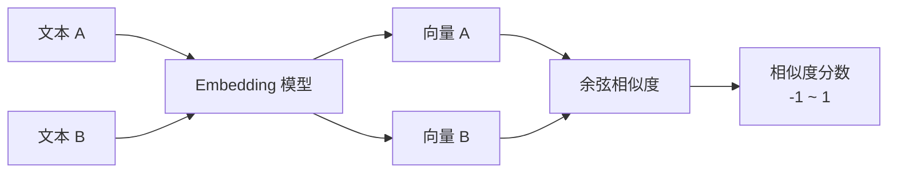

<KeyIdea>
**一句话**：Embedding 把一段文本变成一串数字（一个高维向量），**意思相近的文本向量也接近**。这让计算机第一次拥有了「语义比对」的能力 —— 是 RAG / 推荐 / 聚类 / 去重的基础。
</KeyIdea>

## 是什么

```
"小狗在草地上奔跑"     → [0.12, -0.83, 0.41, ..., 0.07]   (1536 维)
"幼犬在草坪里跑"       → [0.13, -0.81, 0.40, ..., 0.08]   ← 几乎一样
"今天股市大跌"         → [-0.55, 0.22, -0.71, ..., 0.39]  ← 完全不同
```

「**几乎一样**」体现在向量空间里**距离近**（cosine similarity 接近 1）。算两个句子余弦相似度，**就能判断它们是不是说一回事**。

## 打个比方

<Analogy>
- 关键词搜索 = **按字面找** —— 「狗」和「犬」不一样。  
- Embedding 搜索 = **按意思找** —— 把每段话翻译成「**意思的坐标**」，再比谁和谁离得近。
</Analogy>

## 关键概念

<Terms items={[
  { term: "Vector", en: "向量", def: "一串浮点数，常见维度 384 / 768 / 1536 / 3072。维度越高表达力越强、也越贵。" },
  { term: "Cosine Similarity", en: "余弦相似度", def: "比较两个向量「方向」的接近度，结果 -1~1，1 = 完全一致。" },
  { term: "Embedding Model", en: "向量模型", def: "专门把文本转成向量的模型。OpenAI text-embedding-3, BGE, E5, Cohere…" },
  { term: "Dimensionality", en: "维度", def: "向量长度。可裁剪 (Matryoshka) —— 同一个向量截短后仍能用。" },
]} />

## 怎么工作



模型把文本「**投影**」到一个上千维的语义空间里，**位置就代表意思**。

## 实操要点

- **选对模型 > 调参数**：中文场景 BGE / M3E / OpenAI 3-small 都不错，**先 benchmark 你自己的语料**。
- **同一项目用同一模型**：用 A 模型索引、再用 B 模型查询 → **完全失效**。换模型就要重建索引。
- **Token 预算**：Embedding 计费按 token，1M token / 万条文档约几角到几块。**比 LLM 便宜两个数量级**。
- **批量调用**：API 大多支持一次传 100+ 条文本，**比一条一条快几十倍**。
- **能裁就裁**：3072 维向量裁到 512 维（Matryoshka 训练过的模型），存储成本降 6 倍，**召回掉点很少**。

## 易混点

<Compare
  leftTitle="Embedding"
  rightTitle="LLM 输出"
  left={<>
    **数字向量** —— 给计算机算相似度用。
  </>}
  right={<>
    **自然语言文本** —— 给人看。<br />
    完全不同的两类输出。
  </>}
/>

<Compare
  leftTitle="Embedding 检索"
  rightTitle="BM25 关键词检索"
  left={<>
    懂语义、能跨语言。<br />
    召回「意思相近但措辞不同」。
  </>}
  right={<>
    精确字面匹配 / 命名实体强。<br />
    召回「同名同款」。
  </>}
/>

二者最佳实践 = **混合检索**。

## 延伸阅读

- [RAG](/ai/beginner/rag) —— Embedding 最大的应用场景
- [Vector Database](/ai/beginner/vector-db) —— 存大量 Embedding 的基础设施
- [Chunking](/ai/beginner/chunking) —— Embedding 之前的切分策略
