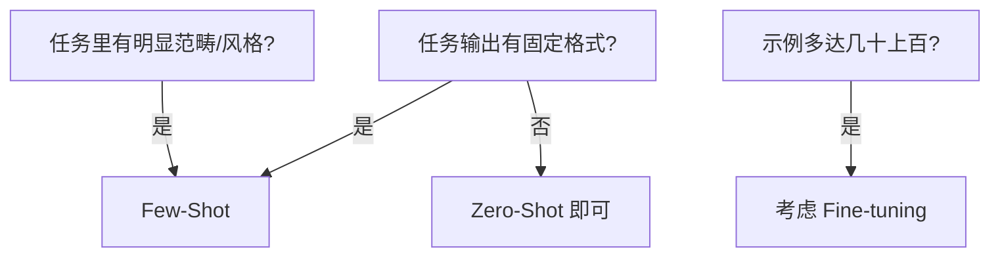

<KeyIdea>
**一句话**：Few-Shot 就是**在 prompt 里塞几个「输入 → 输出」示例**，模型靠模式匹配照着做。不用训练、不改模型，**零成本地让输出对齐你的格式和风格**。
</KeyIdea>

## 是什么

根据给多少示例分：

- **Zero-Shot** —— 一个示例都不给，直接问。
- **One-Shot** —— 给一个示例。
- **Few-Shot** —— 给 2–5 个（再多性价比下降）。

```text
分类下面邮件为 [spam / personal / work]：

邮件: "恭喜中奖! 点击领取..."
类别: spam

邮件: "明天项目会改到下午 3 点"
类别: work

邮件: "周末去爬山吗？"
类别: personal

邮件: "iPhone 限时优惠，仅剩 3 小时"
类别:
```

模型会接着吐出 `spam`。

## 打个比方

<Analogy>
Few-Shot 像给新员工**三份模板**：「以后的合同都按这种格式来写」。他照着模板改改字段就能交稿，**根本不用重新培训**。
</Analogy>

## 关键概念

<Terms items={[
  { term: "In-Context Learning", en: "上下文学习", def: "模型不更新权重，仅靠 prompt 里的示例推断任务 —— LLM 最强能力之一。" },
  { term: "Schema Inference", en: "格式推断", def: "给几个 JSON 示例，输出自然就按这个 JSON 来。" },
  { term: "Order Bias", en: "顺序偏见", def: "示例的顺序会轻微影响输出倾向，最后一个示例影响最大。" },
  { term: "Shot 数量上限", en: "边际递减", def: "一般 3–5 个示例够了。再多收益少、上下文浪费。" },
]} />

## 什么时候用



## 实操要点

- **示例要多样**：3 个例子全是「spam」就把模型带偏。**每个类别都给代表**。
- **放对位置**：系统性格式约束放 system；具体例子放 user 的第一次消息更自然。
- **和 CoT 组合**：示例里把「推理过程」也写出来（Few-Shot + CoT），模型会照着也写推理 —— 比单独用任何一个都强。
- **格式就是契约**：示例里写 `{"label": "spam"}`，模型几乎永远会返回同样结构。
- **注意 Token 成本**：示例会**吃掉每次请求的上下文**。高频调用可考虑 fine-tune 把模式烧进权重。

## 易混点

<Compare
  leftTitle="Few-Shot (运行时)"
  rightTitle="Fine-tuning (训练时)"
  left={<>
    **每次请求**都塞示例。<br />
    零设置成本，但上下文占用。
  </>}
  right={<>
    **训练一次**，示例烧进权重。<br />
    有训练成本，但长期 Token 省。
  </>}
/>

<Compare
  leftTitle="Zero-Shot"
  rightTitle="Few-Shot"
  left={<>
    全靠 prompt 描述 + 模型的世界知识。<br />
    格式复杂时输出容易飘。
  </>}
  right={<>
    示例当**强形式约束**。<br />
    输出格式稳定性直线上升。
  </>}
/>

## 延伸阅读

- [CoT](/ai/beginner/cot) —— Few-Shot + CoT 是「最猛组合」
- [System Prompt](/ai/beginner/system-prompt) —— 示例该放 system 还是 user
- [Fine-tuning / SFT](/ai/advanced/sft) —— 示例多到一定程度就该训练了
