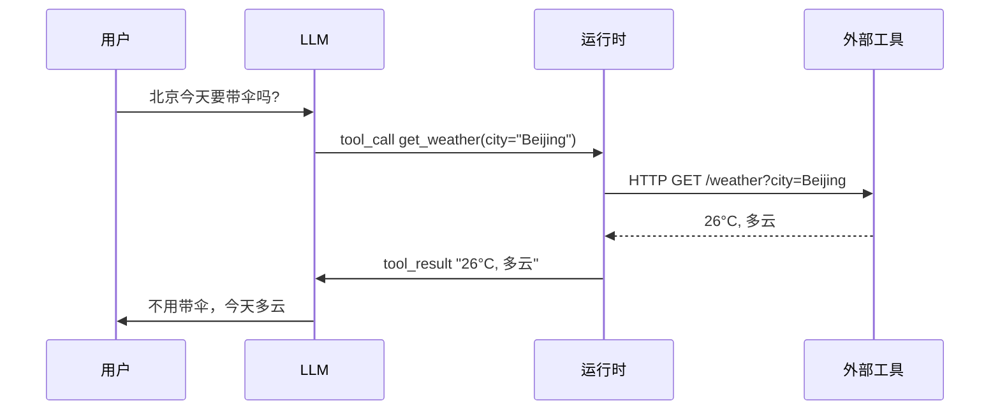

<KeyIdea>
**一句话**：Function Calling 让 LLM **不再只能输出文字** —— 它可以输出一段「**结构化的工具调用 JSON**」，由你的程序去真正执行（查天气、调 API、查数据库），再把结果回喂模型。
</KeyIdea>

## 是什么

你提前告诉模型「我有这些工具可用」：

```json
{
  "name": "get_weather",
  "description": "查指定城市的天气",
  "parameters": {
    "type": "object",
    "properties": {
      "city": { "type": "string", "description": "城市拼音或名字" }
    },
    "required": ["city"]
  }
}
```

模型决定要调用时，**不直接说话**，而是输出：

```json
{
  "tool_calls": [
    { "name": "get_weather", "arguments": { "city": "Beijing" } }
  ]
}
```

你的程序看到这段 JSON，**真的去调** `get_weather("Beijing")`，把返回 `"26°C, 多云"` 拼回给模型，模型再用人话回答用户。

## 打个比方

<Analogy>
没有 Function Calling，模型像个**只会动嘴的客户**：「你帮我查一下天气吧」。  
有了 Function Calling，它像个**会下单的客户**：「**给我执行 `get_weather(city="Beijing")`**」 —— 程序按订单办事。
</Analogy>

## 关键概念

<Terms items={[
  { term: "Tool Definition", en: "工具定义", def: "name + description + JSON schema 参数 —— 喂给模型的「工具说明书」。" },
  { term: "Tool Call", en: "工具调用", def: "模型输出的结构化 JSON，告诉运行时该调哪个工具、传什么参数。" },
  { term: "Tool Result", en: "工具结果", def: "你的程序执行后返回的内容，作为新一轮 prompt 喂回模型。" },
  { term: "Parallel Tool Calls", en: "并行调用", def: "现代模型能一次输出多个独立调用，运行时并发执行后一起回喂。" },
]} />

## 怎么工作



**模型负责「决策」，运行时负责「执行」** —— 这是 Agent 的根基。

## 实操要点

- **工具描述要写工具的 *用途***：「查天气」不如「**根据城市名查询当日天气，用于回答用户出行建议**」 —— 模型选工具的准头几乎全在这里。
- **参数 schema 要严**：枚举值用 `enum`、必填用 `required`、格式用 `pattern` —— 模型几乎不会乱填。
- **失败要返回结构化错误**：不要 `throw`，而是返回 `{error: "city not found"}`，模型才能根据错误改参数重试。
- **并行执行省时间**：现代 SDK 支持一次 N 个工具调用并发，**比串行快几倍**。
- **别给太多工具**：> 20 个工具时模型选错率飙升。**先做意图分类，再路由到该领域的工具子集**。

## 易混点

<Compare
  leftTitle="Function Calling"
  rightTitle="MCP"
  left={<>
    每个产品**自定义的工具 schema**。<br />
    模型 ↔ 工具是 1:1 绑定。
  </>}
  right={<>
    **跨产品的标准化协议**。<br />
    任意 MCP server 都能即插即用。
  </>}
/>

<Compare
  leftTitle="Function Calling"
  rightTitle="Plugin / Action"
  left={<>
    **底层协议**：模型层面的 JSON 输出。
  </>}
  right={<>
    **应用层封装**：ChatGPT Plugin / Action 都是 Function Calling + 商店分发。
  </>}
/>

## 延伸阅读

- [MCP](/ai/beginner/mcp) —— Function Calling 的「USB-C 化」
- [Skills](/ai/beginner/skills) —— 把若干工具打包成「能力」
- [Code Interpreter](/ai/beginner/code-interpreter) —— 模型执行任意代码的特殊「工具」
- [ReAct](/ai/beginner/react) —— 在循环里反复调用 tool 的范式
