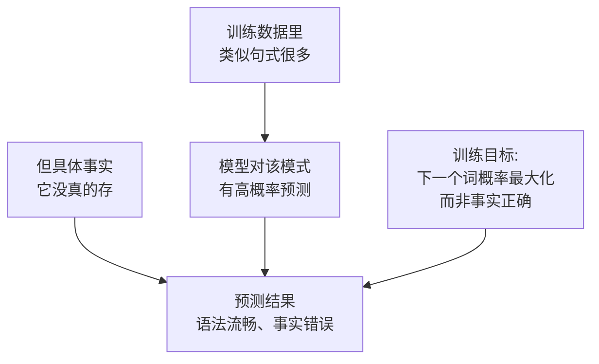

<KeyIdea>
**一句话**：幻觉就是 LLM **「编」出听起来很像真的、但和事实不符**的内容。它不是 bug，而是「下一个词概率最大化」机制下的天然副作用 —— 模型不知道自己不知道。
</KeyIdea>

## 是什么

LLM 没有「事实数据库」。它只是根据训练数据**预测最像下一个词的东西**。所以会出现：

- **编造引用**：「论文 Smith 2021 证明了……」 —— 论文根本不存在；
- **编造 API**：「`requests.fetch(url)`」 —— 这个方法 requests 库里没有；
- **细节错乱**：把人物、年份、数字张冠李戴，但句法极其流畅。

## 打个比方

<Analogy>
LLM 像一个**特别能编故事的临时演员**：你让他扮演「百科教授」，他不会承认「我也不知道」，而是**根据语感把答案凑出来** —— 听起来很像真的，但**真假参半**。
</Analogy>

## 关键概念

<Terms items={[
  { term: "事实性幻觉", en: "Factual", def: "客观信息错误：人物、日期、引文、数据等。" },
  { term: "上下文幻觉", en: "Context Drift", def: "和你给的资料不符 —— 「文档里没有，模型瞎补的」。" },
  { term: "格式幻觉", en: "Schema Drift", def: "你要 JSON，它给了多余字段或缺字段。" },
  { term: "工具幻觉", en: "Tool Drift", def: "Function Calling 时编不存在的工具或参数。" },
]} />

## 为什么会幻觉

**核心矛盾**：模型的损失函数只奖励「像训练数据」，**不直接奖励「事实正确」**。

## 实操要点（怎么压幻觉）

- **接 RAG**：让模型基于真实文档回答 —— [RAG](/ai/beginner/rag) 是工业界标准答案。
- **强约束 prompt**：「**只用我提供的资料，没有就回答「不知道」**」。这一句就能砍掉一大半幻觉。
- **要溯源**：让模型在每个论断后引用文档片段 ID / 页码，**没法引用就强制 say I don't know**。
- **降温度**：对事实性任务把 [Temperature](/ai/beginner/temperature) 调到 0–0.3，减少随机发挥。
- **用工具核对**：金额、日期、SQL 结果之类，让 [Code Interpreter](/ai/beginner/code-interpreter) 现场算。
- **两阶段自校**：先让模型答，再让它「检查上一段是否有未引用的论断」 —— [Reflection](/ai/advanced/reflection)。

## 易混点

<Compare
  leftTitle="幻觉"
  rightTitle="过期 / 不知"
  left={<>
    模型**编造**了根本不存在的事实。 
    通常很「自信」，没有不确定信号。
  </>}
  right={<>
    模型「**知识截止**」之后的事不知道。 
    可以用 RAG / 联网搜索补救。
  </>}
/>

<Callout type="warn" title="律师 / 医疗 / 金融场景">
关键决策**永远不要直接信任 LLM 输出**。要么人工复核，要么 RAG + 严格引用 + 拒答机制。
</Callout>

## 延伸阅读

- [RAG](/ai/beginner/rag) —— 把幻觉踩到最低的标准方案
- [Temperature & Top-P](/ai/beginner/temperature) —— 用采样参数压住「胡编」
- [Reflection](/ai/advanced/reflection) —— 让模型自己检查自己
