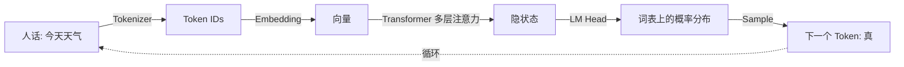

<KeyIdea>
**一句话**：LLM = Large Language Model，本质是一个被海量文本喂大的「**超级补全机**」 —— 你给它一段话，它用概率挑出最可能的下一个 Token，再一个一个吐出来，看起来像在思考。
</KeyIdea>

## 是什么

GPT、Claude、Gemini、Qwen…… 不管底下用什么框架，**核心数学都极其朴素**：

> 给定上文 `x₁ x₂ … xₙ`，预测下一个最可能的 Token `xₙ₊₁`。

把这件事重复几千次，就生成了一段流利的回答。所以你看到的「智能」，本质是**亿万次条件概率的累加**。

## 打个比方

<Analogy>
LLM 像一位**接梗鬼才**朋友：你说半句，他立刻接住下半句。只是他读的「段子」是整个互联网，外加几千万本书、代码、论文。
</Analogy>

## 关键概念

<Terms items={[
  { term: "Tokenizer", en: "分词器", def: "把人话切成一串数字 ID 的入口。" },
  { term: "Embedding", en: "嵌入层", def: "把每个 Token ID 翻译成向量，让模型能做数学运算。" },
  { term: "Transformer Blocks", en: "多层网络", def: "整个模型最重的部分 —— 注意力 + 前馈网络堆叠几十上百层。" },
  { term: "LM Head", en: "输出头", def: "在词表上算概率分布，挑出下一个 Token。" },
]} />

## 怎么工作

**循环这个过程**，直到模型吐出一个「停止」Token，整段回答就生成完了。

## 实操要点

- **它是概率机器**：所谓「理解、推理、创意」全都建立在「下一个 Token 的概率」上 —— 所以它**会编**（参见 [Hallucination](/ai/beginner/hallucination)）。
- **它没有实时世界**：模型有「知识截止日期」。需要最新信息，要靠 [RAG](/ai/beginner/rag) 或工具调用补。
- **它不会真正学习**：跟它聊一万次，权重一个字节都不变。要让它「记住」，要么微调，要么靠 [外部记忆](/ai/beginner/long-term-memory)。

## 易混点

<Compare
  leftTitle="LLM"
  rightTitle="搜索引擎"
  left={<>
    **生成式**：现场拼概率写答案。 
    答案**可能错**，因为它编的也合理。
  </>}
  right={<>
    **检索式**：从已有页面里挑。 
    答案是来源页里**真实存在**的文字。
  </>}
/>

## 常见 LLM 一览

| 模型 | 厂商 | 特点 |
|---|---|---|
| GPT-5 / GPT-4o | OpenAI | 通用、推理、Tool 调用 |
| Claude Sonnet 4.5 | Anthropic | 长上下文、写作、代码 |
| Gemini 2.5 | Google | 多模态、视频理解 |
| Qwen3 / DeepSeek V3 | 阿里 / 深度求索 | 中文、性价比、可本地部署 |
| Llama 4 | Meta | 开源自托管基线 |

## 延伸阅读

- [Token (词元)](/ai/beginner/token) —— LLM 处理的最小单位
- [Context Window (上下文窗口)](/ai/beginner/context-window) —— 它一次能看多少
- [Parameters (参数量)](/ai/beginner/parameters) —— 7B / 72B 究竟意味着什么
- [Hallucination (幻觉)](/ai/beginner/hallucination) —— 它为什么会一本正经胡说
