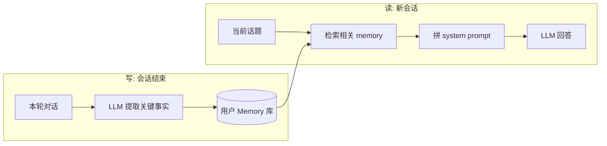

<KeyIdea>
**一句话**：长期记忆 = 把用户**跨会话**的关键信息（偏好、关系、历史决定）持久存起来，每次新会话**检索回相关条目**塞进 prompt。让 AI 不再每次「从零开始认识你」。
</KeyIdea>

## 是什么

短期记忆只能管当前会话。长期记忆负责：

```
2024-09-01: 用户提到「我对花生过敏」
2024-09-15: 用户偏好简洁回答，不喜欢列表
2024-11-02: 用户在做副业 SaaS，技术栈 Next.js

→ 写入用户 memory store

下次会话开始时:
  检索与本轮话题相关的 memory，前 3 条拼进 system prompt
```

每次新对话，AI 先「**翻笔记**」再开口，**就像老朋友一样**。

## 打个比方

<Analogy>
短期记忆 = **今天聊天里的笔记**，散会就忘。  
长期记忆 = **关于这个人的 Notion 页面**，下次见面前先翻一遍重要条目。**这就是「认识你」的差别**。
</Analogy>

## 关键概念

<Terms items={[
  { term: "Extraction", en: "事实提取", def: "对话结束 / 关键节点跑一次 LLM，抽出「值得记」的事实。" },
  { term: "Memory Store", en: "记忆库", def: "通常是向量库 + 元数据。每条记忆 = 一个事实 + embedding + 时间。" },
  { term: "Retrieval", en: "记忆检索", def: "新会话开始时按当前话题检索 top-K 记忆，塞进 system prompt。" },
  { term: "Update / Decay", en: "更新与遗忘", def: "新事实覆盖旧的；很久没用的记忆降权或删除。" },
]} />

## 怎么工作



写一次（异步、便宜）、读多次（每个会话都做）。

## 实操要点

- **不是什么都记**：闲聊、临时问题别写。**只记「跨会话仍有价值」的事实** —— 偏好、关键人际关系、长期目标。
- **Extraction prompt 要给 schema**：让模型用 JSON 输出 `{type, content, expires_at}`，而不是自由文字。**避免噪声爆炸**。
- **冲突要解决**：用户说「**我现在改用 Vue 了**」就要更新或废掉旧的「Next.js 偏好」记忆。**不要无脑追加**。
- **明确给用户「记忆查看 / 删除」入口**：合规 + 信任。ChatGPT 的 Memory 页就是范例。
- **小项目可以用 SQLite + 一个 LLM 提取脚本起步**：不用一上来就上 Mem0 / Letta / LangMem 这些重型库。

## 易混点

<Compare
  leftTitle="长期记忆"
  rightTitle="RAG 知识库"
  left={<>
    存**用户个人**的事实。<br />
    内容随会话动态写入 / 更新。
  </>}
  right={<>
    存**所有用户共享**的资料。<br />
    内容由后台批量索引。
  </>}
/>

<Compare
  leftTitle="长期记忆"
  rightTitle="微调 (SFT)"
  left={<>
    **运行时检索**：每个用户的记忆独立。<br />
    便宜、可即时新增。
  </>}
  right={<>
    把记忆烧进权重。<br />
    不可个人化、贵、不灵活。
  </>}
/>

## 延伸阅读

- [Short-term Memory](/ai/beginner/short-term-memory) —— 配套使用
- [RAG](/ai/beginner/rag) —— 长期记忆的检索阶段就是个 mini RAG
- [Embeddings](/ai/beginner/embeddings) —— 记忆按 embedding 检索
