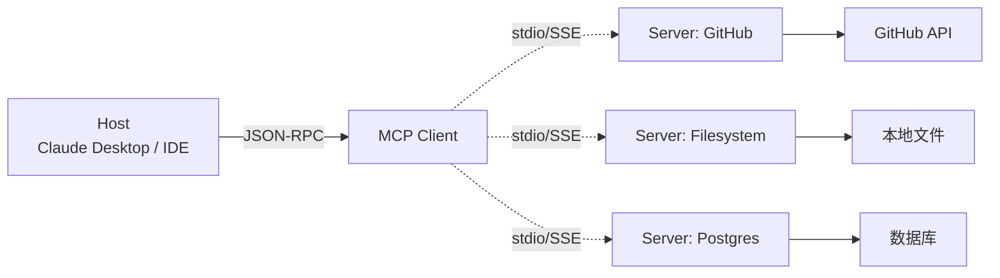

<KeyIdea>
**一句话**：MCP = **Model Context Protocol**，是 Anthropic 推动的「**模型 ↔ 外部世界**」开放协议。它把「工具、数据、提示」三类资源用统一接口暴露 —— 任何 MCP server 都能被任何 MCP client (Claude Desktop / IDE / 自家 Agent) 即插即用。
</KeyIdea>

## 是什么

没有 MCP 之前，每个产品都得自己定义工具协议（OpenAI 一种、Anthropic 一种、自家平台又一种）。MCP 把它们标准化为：

- **Tools** —— 可调用函数
- **Resources** —— 可读取的数据（文件、DB 行）
- **Prompts** —— 可重用的提示模板

Server 暴露这三类东西，Client 通过 stdio / WebSocket 连进来，就能让模型用上。

## 打个比方

<Analogy>
- 以前：每家电脑都用**专属充电口** —— 每换一个就要新转换头。
- MCP：**Type-C 化** —— 一根线接哪儿都通。  
对模型来说就是：**写一次工具，到处都能用**。
</Analogy>

## 关键概念

<Terms items={[
  { term: "MCP Server", en: "MCP 服务", def: "暴露 Tools / Resources / Prompts 的进程。本地启动或远程托管均可。" },
  { term: "MCP Client", en: "MCP 客户端", def: "支持 MCP 的 host —— Claude Desktop / Cursor / Cline / 自研 Agent。" },
  { term: "Transport", en: "通信协议", def: "stdio (本地子进程) 或 SSE / WebSocket (远程)。消息是 JSON-RPC 2.0。" },
  { term: "Tool / Resource / Prompt", en: "三种资源", def: "Tools 可执行；Resources 可读取（文件、DB）；Prompts 是预设提示模板。" },
]} />

## 怎么工作

模型通过 Host → Client → 任意一个 Server，就能用上对应能力。**新增一个 Server，整个生态都能用**。

## 实操要点

- **本地起服务很快**：装个 `mcp-server-filesystem`、改一行 `claude_desktop_config.json`，Claude 就能读你电脑了。
- **官方 / 社区 server 已经很全**：GitHub、Slack、Postgres、Notion、Brave Search、Puppeteer……**先找现成的再自研**。
- **自研 server 用官方 SDK**：`mcp` (Python) / `@modelcontextprotocol/sdk` (TS) 几十行代码就能起。
- **权限要细**：MCP server 跑在本地、能读文件 / 调 API —— **作用域要最小化**，避免被恶意 prompt 注入劫持。
- **不是非此即彼**：你完全可以**应用内继续用 Function Calling**，**对外开放部分能力时再走 MCP**。

## 易混点

<Compare
  leftTitle="MCP"
  rightTitle="Function Calling"
  left={<>
    **跨厂商通用协议**。 
    一个 server 能给任何 host 用。
  </>}
  right={<>
    **每个模型自定义的 schema**。 
    工具和模型耦合在一起。
  </>}
/>

<Compare
  leftTitle="MCP"
  rightTitle="OpenAPI / REST"
  left={<>
    **专为 LLM 设计**：tool description 用自然语言。 
    支持 Resources / Prompts 两类「非函数」语义。
  </>}
  right={<>
    人类工程师 / 程序设计的 API。 
    没有 LLM 友好的能力发现机制。
  </>}
/>

## 延伸阅读

- [Function Calling](/ai/beginner/function-calling) —— MCP 的「单家版本」
- [Skills](/ai/beginner/skills) —— Anthropic 的另一种能力打包方案
- [Code Interpreter](/ai/beginner/code-interpreter) —— 不靠 MCP 也能给模型「手脚」
- 官方文档：[modelcontextprotocol.io](https://modelcontextprotocol.io)
