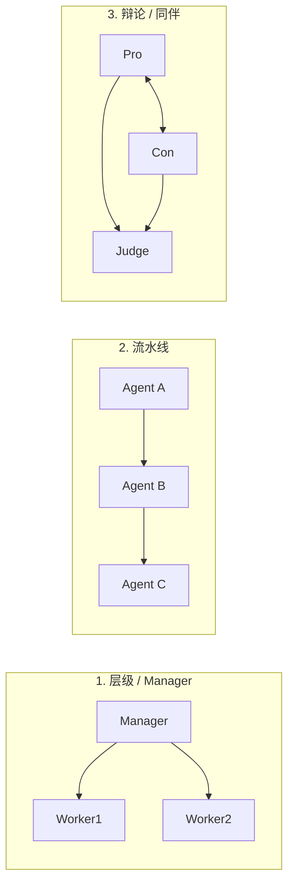

<KeyIdea>
**一句话**：Multi-Agent 就是**多个具备不同 system prompt 的 Agent 通过「对话」协作**。每个 Agent 有自己的角色（PM / 工程师 / 评审 / QA），通过消息传递把一个大任务做完。
</KeyIdea>

## 是什么

单 Agent 什么都干，容易变成「样样通、样样松」。Multi-Agent 把工作分给多个**专业 Agent**：

```
PM Agent       → 拆需求、出验收标准
Coder Agent    → 写代码
Reviewer Agent → Code Review，挑刺
Tester Agent   → 写并跑测试
```

它们之间用结构化消息互相喊话，由一个 **Orchestrator (协调者)** 调度。

## 打个比方

<Analogy>
单 Agent 像**全能临时工**，事事都做但都做得一般。  
Multi-Agent 像**正常软件团队**：PM、前端、后端、QA 各管一摊，**专人专事 + 互相评审 = 质量更稳**。
</Analogy>

## 关键概念

<Terms items={[
  { term: "Role", en: "角色", def: "每个 Agent 一个 system prompt，定义身份、职责、输出格式。" },
  { term: "Orchestrator", en: "协调者", def: "决定哪个 Agent 上场、怎么传消息 —— 可以是另一个 Agent，也可以是固定流程。" },
  { term: "Conversation", en: "消息流", def: "Agent 间的通信日志，本身就是状态。" },
  { term: "Memory", en: "共享 / 私有记忆", def: "公共白板 (shared) + 每个 Agent 自己的笔记 (private)。" },
]} />

## 三种常见拓扑



- **层级**：Manager 拆活、Worker 干活、汇总。AutoGen 的 GroupChat、CrewAI 默认。
- **流水线**：固定顺序，每个 Agent 只看上游产物。简单稳定。
- **辩论**：两个意见相反的 Agent 互相挑刺，第三个做裁判 —— **逼出更高质量答案**。

## 实操要点

- **不要一上来就上 5 个 Agent**：先用单 Agent 跑通，**确实搞不定才拆**。每多一个 Agent 上下文成本和失败概率都上一截。
- **Role 要清楚 + 互不重叠**：「Reviewer 只挑代码错误，**不写代码**；Coder 只写代码，**不评审**」 —— 角色交叉是混乱的来源。
- **结构化消息**：Agent 间不要自由对话，用 `{from, to, type, content}` 的 JSON。**便于路由 + 日志 + 限流**。
- **加上「停止人」**：辩论模式要有 max_rounds，否则两个 Agent 会无限对线。
- **共享白板优先**：所有 Agent 写一个 markdown / DB，比 N×N 互发消息便宜得多。

## 易混点

<Compare
  leftTitle="Multi-Agent"
  rightTitle="Workflow + 多个 prompt"
  left={<>
    Agent 们**自主对话**，谁说什么由模型决定。<br />
    灵活，但可能跑题。
  </>}
  right={<>
    人事先连好节点 / 边。<br />
    每步 prompt 不同但**流转固定**。
  </>}
/>

## 延伸阅读

- [Agent](/ai/beginner/agent) —— 单 Agent 的基础
- [Workflow](/ai/beginner/workflow) —— Multi-Agent 的「确定性兄弟」
- [Planning](/ai/beginner/planning) —— Manager Agent 的核心能力
- [LangGraph](/ai/ecosystem/langgraph) —— 工业里最常用的 Multi-Agent 框架
