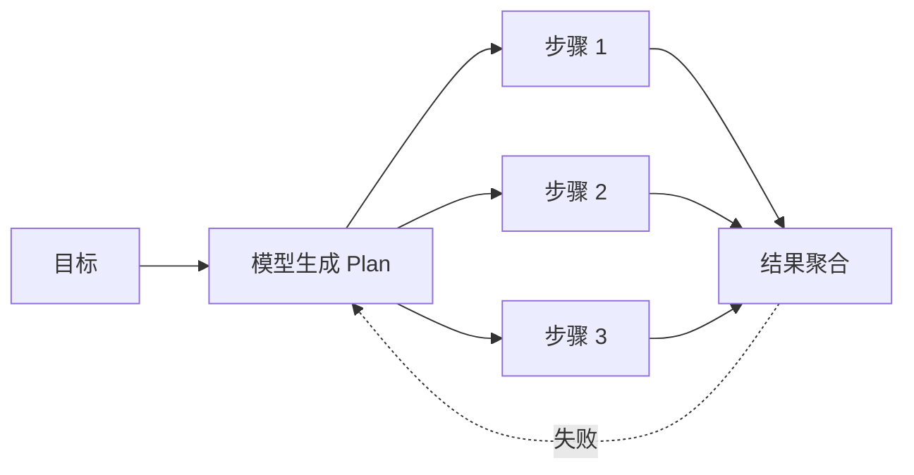

<KeyIdea>
**一句话**：Planning 就是让 Agent**先把大任务拆成可执行的小步骤**，再一步一步做 —— 是从「能聊」到「能办事」的关键能力。
</KeyIdea>

## 是什么

复杂任务（「帮我写一个 SaaS 落地页」「分析这家公司财报」）模型一步答不出来。Planning 把它拆成：

```
目标: 写一个 SaaS 落地页

计划:
  1. 确定产品定位（与用户对话）
  2. 起草大纲（Hero / Features / Pricing / FAQ）
  3. 为每个区块写文案
  4. 选配色和字体
  5. 输出 HTML
```

之后 Agent 按计划一步步执行，**每一步都是一个更小、更易解决的子问题**。

## 打个比方

<Analogy>
Planning 像**装修队的施工计划**：「先拆墙、再走水电、再粉刷、最后铺地板」。一次想清楚顺序、谁先谁后，**比临场决定快得多、错得少**。
</Analogy>

## 关键概念

<Terms items={[
  { term: "Plan", en: "计划", def: "一个有序步骤列表，每步是一个可执行的子任务。" },
  { term: "Replan", en: "重新规划", def: "执行中发现计划不可行 —— 让模型基于新观察改计划。" },
  { term: "Decomposition", en: "任务分解", def: "把一个大目标递归拆成树状的子目标。" },
  { term: "DAG / Graph", en: "依赖图", def: "复杂任务里某些步骤可以并行，画图能看清依赖。" },
]} />

## 三种主流姿势

### 1. ReAct（边想边做）

每一步都重新决策，**自然带 planning**。简单但可能反复试错。

### 2. Plan & Execute（先想完再做）

先一次性输出完整计划，再按计划批量执行。**Token 省、可观测性好**，但中途出错要 replan。

### 3. ReWOO / LLMCompiler（异步 / 并行）

把 plan 编译成可并行执行的图，**多个工具调用同时跑** —— 适合大量独立子任务。



## 实操要点

- **任务复杂才用**：简单一问一答**别 plan**，画蛇添足。
- **Plan 也要做 schema**：让模型用 JSON 输出 `[{step, action, args}]`，便于程序消费、不易跑偏。
- **设置「最大步骤数」**：防止过度分解 —— 5–10 步通常足够，再多就该拆成 Multi-Agent。
- **Plan 之后再来一遍验证**：最便宜的 Reflection 招式就是让模型自己看一眼自己生成的计划，问「**有遗漏吗**」。
- **Replan 要有触发条件**：不是每步都 replan（贵），而是工具失败 / 观察出乎意料时再触发。

## 易混点

<Compare
  leftTitle="Planning (临时)"
  rightTitle="Workflow (固定)"
  left={<>
    **运行时由模型生成**步骤。<br />
    灵活，能处理新任务。
  </>}
  right={<>
    **开发时人定义**好节点和流转。<br />
    稳定，能保证关键步骤一定走到。
  </>}
/>

## 延伸阅读

- [ReAct](/ai/beginner/react) —— 自带 planning 的经典范式
- [Multi-Agent](/ai/beginner/multi-agent) —— Plan 拆开后多个 Agent 分工
- [Reflection](/ai/advanced/reflection) —— 让模型自我校对计划质量
