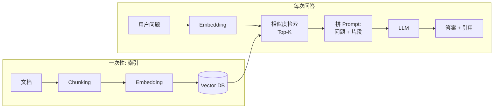

<KeyIdea>
**一句话**：RAG = **Retrieval-Augmented Generation**，先从你自己的资料库里检索出相关片段，**再把它拼进 prompt 里让模型基于资料回答**。是给 LLM 接「私有知识 / 实时数据 / 大文档」的工业标准答案。
</KeyIdea>

## 是什么

LLM 自带的知识有截止日期，也不知道你的私有资料。RAG 不改模型权重，而是**临时把资料塞进上下文**：

```
用户问: 我们 Q3 的退款政策是什么？

[检索] 从公司知识库找到 3 个最相关片段
[拼装] 把片段 + 问题塞进 prompt
[生成] 模型基于片段写出答案 + 引用源文档
```

模型每次回答都基于「**它当下被喂的真实资料**」 —— 知识库一更新，回答立刻跟上。

## 打个比方

<Analogy>
没 RAG 的 LLM = **闭卷考试** —— 只能靠记忆，可能记错。  
RAG = **开卷考试** —— 要答之前先翻参考书，**抄重点 + 自己组织语言**。准确率立刻上一个量级。
</Analogy>

## 关键概念

<Terms items={[
  { term: "Embedding", en: "向量化", def: "把文本转成向量，便于按「语义相似」检索（不只看关键词）。" },
  { term: "Vector DB", en: "向量数据库", def: "存向量并支持快速近邻搜索的专用 DB（pgvector / Milvus / Qdrant…）。" },
  { term: "Chunking", en: "分块", def: "长文档切成 200–800 字的片段，便于检索和喂模型。" },
  { term: "Top-K Retrieval", en: "Top-K 检索", def: "返回相似度最高的 K 个片段（通常 3–10）。" },
  { term: "Rerank", en: "重排", def: "对 top-K 用更精的模型再打一次分，把最相关的几条挤到最前。" },
]} />

## 怎么工作



**索引一次（offline）**，**查询每次都做（online）**。

## 实操要点

- **召回比生成重要**：RAG 答错 80% 的原因是「没检索到对的片段」。先优化召回（chunking + embedding 模型 + rerank），再调 prompt。
- **Chunk 要包含上下文**：纯切 500 字会丢标题、章节信息。给每个 chunk 拼上「文档名 + 章节标题」效果立刻飙升。
- **Hybrid Retrieval**：向量检索 + BM25 关键词检索一起用，二者投票后 rerank —— 是当前最稳的姿势。
- **强制引用**：prompt 里要求模型「**每个论断后用 [^1] 标记引用片段编号**」，没办法引用的就拒答 —— **极大压幻觉**。
- **Top-K 不是越大越好**：K = 3–5 通常最优。K 过大会塞入无关片段，**反而稀释正确答案**。

## 易混点

<Compare
  leftTitle="RAG"
  rightTitle="Fine-tuning"
  left={<>
    **运行时**注入资料。<br />
    内容随时更新；不改模型。
  </>}
  right={<>
    **训练时**把知识烧进权重。<br />
    成本高、不易更新。
  </>}
/>

<Compare
  leftTitle="RAG"
  rightTitle="长上下文 (1M tokens)"
  left={<>
    检索后只塞**相关片段**。<br />
    便宜、快、规模可拓展。
  </>}
  right={<>
    一次塞**整个资料库**。<br />
    贵、慢、有效注意力会下降。
  </>}
/>

## 延伸阅读

- [Embeddings](/ai/beginner/embeddings) —— RAG 的「语义指纹」
- [Vector Database](/ai/beginner/vector-db) —— 存放和检索 embedding 的基础设施
- [Chunking](/ai/beginner/chunking) —— 切分策略决定 RAG 上限
- [LangChain](/ai/ecosystem/langchain) / [LlamaIndex](/ai/ecosystem/llamaindex) —— 主流 RAG 框架
